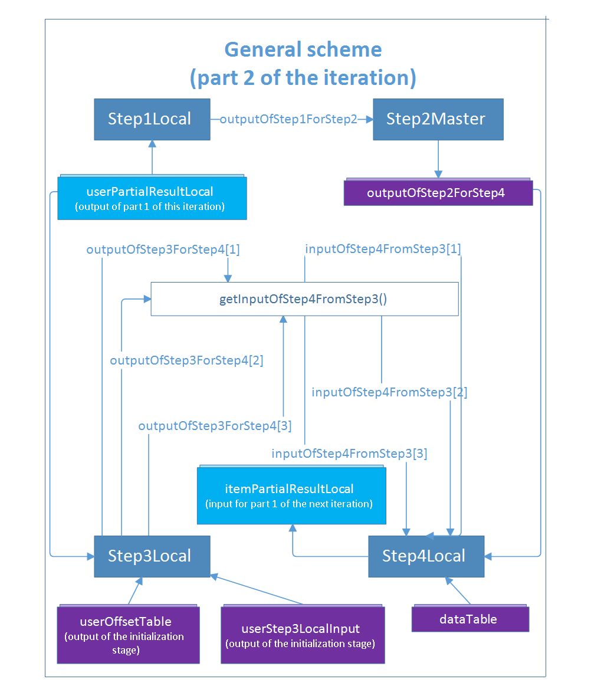
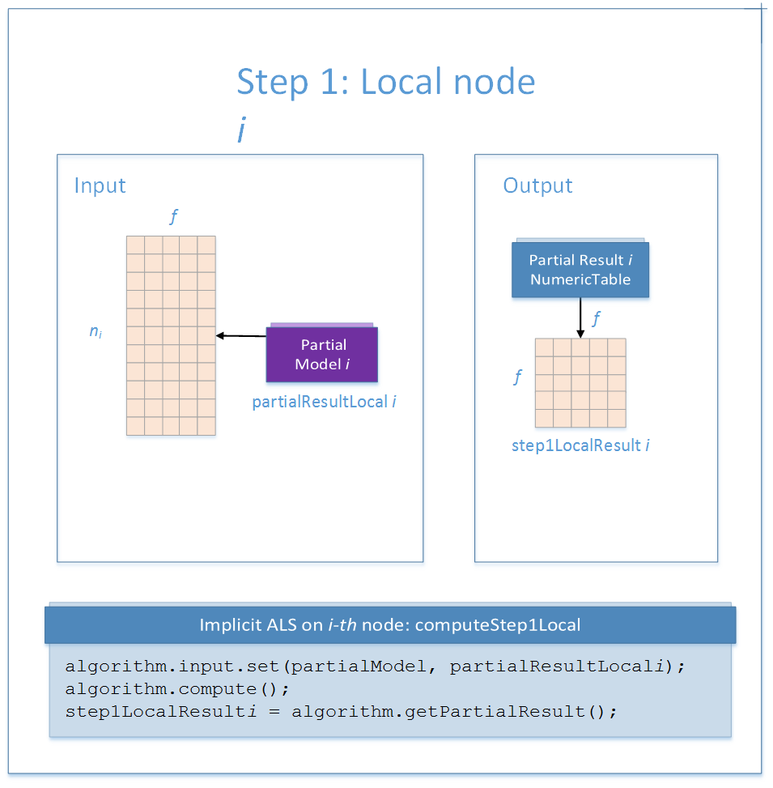
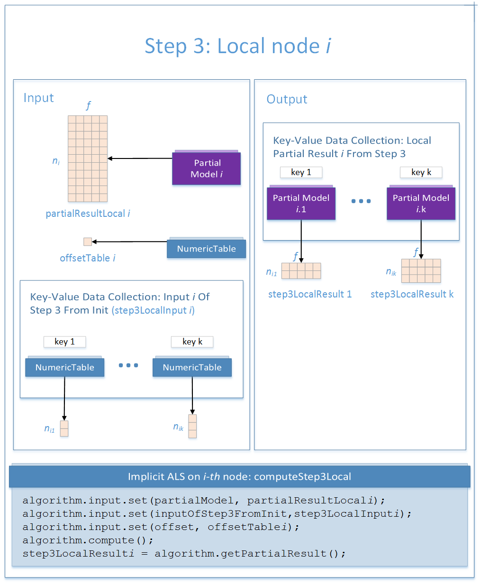
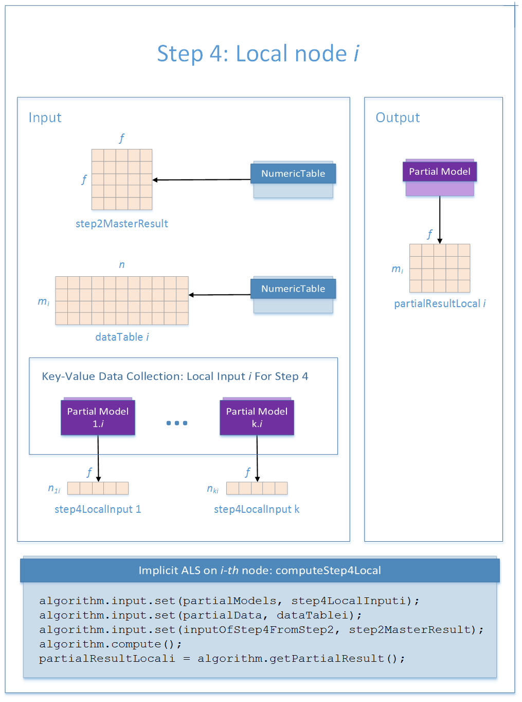

.. Copyright 2020 Intel Corporation
..
.. Licensed under the Apache License, Version 2.0 (the "License");
.. you may not use this file except in compliance with the License.
.. You may obtain a copy of the License at
..
..     http://www.apache.org/licenses/LICENSE-2.0
..
.. Unless required by applicable law or agreed to in writing, software
.. distributed under the License is distributed on an "AS IS" BASIS,
.. WITHOUT WARRANTIES OR CONDITIONS OF ANY KIND, either express or implied.
.. See the License for the specific language governing permissions and
.. limitations under the License.

.. _implicit_als_distributed_training:

Distributed Processing: Training
================================

The distributed processing mode assumes that the data set is split in ``nblocks`` blocks across computation nodes.

Algorithm Parameters
********************

At the training stage, implicit ALS recommender in the distributed processing mode has the following parameters:

.. tabularcolumns::  |\Y{0.15}|\Y{0.15}|\Y{0.7}|

.. list-table:: Training Parameters for Implicit Alternating Least Squares Computation (Distributed Processing)
   :widths: 10 10 60
   :header-rows: 1
   :align: left
   :class: longtable

   * - Parameter
     - Default Value
     - Description
   * - ``computeStep``
     - Not applicable
     - The parameter required to initialize the algorithm. Can be:

       - ``step1Local`` - the first step, performed on local nodes
       - ``step2Master`` - the second step, performed on a master node
       - ``step3Local`` - the third step, performed on local nodes
       - ``step4Local`` - the fourth step, performed on local nodes
   * - ``algorithmFPType``
     - ``float``
     - The floating-point type that the algorithm uses for intermediate computations. Can be ``float`` or ``double``.
   * - ``method``
     - ``fastCSR``
     - Performance-oriented computation method for CSR numeric tables, the only method supported by the algorithm.
   * - ``nFactors``
     - :math:`10`
     - The total number of factors.
   * - ``maxIterations``
     - :math:`5`
     - The number of iterations.
   * - ``alpha``
     - :math:`40`
     - The rate of confidence.
   * - ``lambda``
     - :math:`0.01`
     - The parameter of the regularization.
   * - ``preferenceThreshold``
     - :math:`0`
     - Threshold used to define preference values. :math:`0` is the only threshold supported so far.

.. _implicit_als_computation_parts:

Computation Process
*******************

At each iteration, the implicit ALS training algorithm alternates between re-computing user factors (:math:`X`) and item factors (:math:`Y`).
These computations split each iteration into the following parts:

#. Re-compute all user factors using the input data sets and item factors computed previously.

#. Re-compute all item factors using input data sets in the transposed format and item factors computed previously.

Each part includes four steps executed either on local nodes or on the master node,
as explained below and illustrated by graphics for :math:`\mathrm{nblocks} = 3`.
The main loop of the implicit ALS training stage is executed on the master node.

.. figure:: images/implicit-als-distributed-computation-training-general-scheme-1.png
    :width: 600
    :align: center
    :alt:

    Implicit Alternating Least Squares Computation: Part 1

    Implicit Alternating Least Squares Computation: Part 2

.. _implicit_als_distributed_training_step_1:

Step 1 - on Local Nodes
***********************

This step works with the matrix:

- :math:`Y^T` in :ref:`part 1 <implicit_als_computation_parts>` of the iteration
- :math:`X` in :ref:`part 2 <implicit_als_computation_parts>` of the iteration

Parts of this matrix are used as input partial models.

    Training with Implicit Alternating Least Squares: Distributed Processing, Step 1 - on Local Nodes

In this step, implicit ALS recommender training accepts the input described below.
Pass the ``Input ID`` as a parameter to the methods that provide input for your algorithm.
For more details, see :ref:`algorithms`.

.. tabularcolumns::  |\Y{0.2}|\Y{0.8}|

.. list-table:: Input for Implicit Alternating Least Squares Computation (Distributed Processing, Step 1)
   :widths: 10 60
   :header-rows: 1

   * - Input ID
     - Input
   * - ``partialModel``
     - Partial model computed on the local node.

In this step, implicit ALS recommender training calculates the result described below.
Pass the ``Result ID`` as a parameter to the methods that access the results of your algorithm.
For more details, see :ref:`algorithms`.

.. tabularcolumns::  |\Y{0.2}|\Y{0.8}|

.. list-table:: Output for Implicit Alternating Least Squares Computation (Distributed Processing, Step 1)
   :widths: 10 60
   :header-rows: 1
   :align: left

   * - Result ID
     - Result
   * - ``outputOfStep1ForStep2``
     - Pointer to the :math:`f \times f` numeric table with the sum of numeric tables
       calculated in :ref:`Step 1 <implicit_als_distributed_training_step_1>`.

.. _implicit_als_distributed_training_step_2:

Step 2 - on Master Node
***********************

This step uses local partial results from :ref:`Step 1 <implicit_als_distributed_training_step_1>` as input.

.. figure:: images/implicit-als-distributed-computation-training-step-2.png
    :width: 600
    :align: center
    :alt:

    Training with Implicit Alternating Least Squares: Distributed Processing, Step 2 - on Master Node

In this step, implicit ALS recommender training accepts the input described below.
Pass the ``Input ID`` as a parameter to the methods that provide input for your algorithm.
For more details, see :ref:`algorithms`.

.. tabularcolumns::  |\Y{0.2}|\Y{0.8}|

.. list-table:: Input for Implicit Alternating Least Squares Computation (Distributed Processing, Step 2)
   :widths: 10 60
   :header-rows: 1

   * - Input ID
     - Input
   * - ``inputOfStep2FromStep1``
     - A collection of numeric tables computed on local nodes in :ref:`Step 1 <implicit_als_distributed_training_step_1>`.

       .. note::
            The collection may contain objects of any class derived from ``NumericTable``
            except the ``PackedTriangularMatrix`` class with the ``lowerPackedTriangularMatrix`` layout.

In this step, implicit ALS recommender training calculates the result described below.
Pass the ``Result ID`` as a parameter to the methods that access the results of your algorithm.
For more details, see :ref:`algorithms`.

.. tabularcolumns::  |\Y{0.2}|\Y{0.8}|

.. list-table:: Output for Implicit Alternating Least Squares Computation (Distributed Processing, Step 2)
   :widths: 10 60
   :header-rows: 1
   :align: left

   * - Result ID
     - Result
   * - ``outputOfStep2ForStep4``
     - Pointer to the :math:`f \times f` numeric table with merged cross-products.

.. _implicit_als_distributed_training_step_3:

Step 3 - on Local Nodes
***********************

On each node :math:`i`, this step uses results of the previous steps and requires
that you provide two extra matrices Offset Table i and Input of Step 3 From Init i
computed at the initialization stage of the algorithm.

The only element of the Offset Table i table refers to the:

- :math:`i`-th element of the ``offsets`` collection from the
  :ref:`step 2 of the distributed initialization algorithm <implicit_als_distributed_init_step_2>` in :ref:`part 1 <implicit_als_computation_parts>` of the iteration
- :math:`i`-th element of the ``offsets`` collection from the
  :ref:`step 1 of the distributed initialization algorithm <implicit_als_distributed_init_step_1>` in :ref:`part 2 <implicit_als_computation_parts>` of the iteration

The Input Of Step 3 From Init is a key-value data collection that refers to the ``outputOfInitForComputeStep3`` output of the initialization stage:

- Output of the :ref:`step 1 of the distributed initialization algorithm <implicit_als_distributed_init_step_1>` in :ref:`part 1 <implicit_als_computation_parts>` of the iteration
- Output of the :ref:`step 2 of the distributed initialization algorithm <implicit_als_distributed_init_step_2>` in :ref:`part 2 <implicit_als_computation_parts>` of the iteration

    Training with Implicit Alternating Least Squares: Distributed Processing, Step 3 - on Local Nodes

In this step, implicit ALS recommender training accepts the input described below.
Pass the ``Input ID`` as a parameter to the methods that provide input for your algorithm.
For more details, see :ref:`algorithms`.

.. tabularcolumns::  |\Y{0.2}|\Y{0.8}|

.. list-table:: Input for Implicit Alternating Least Squares Computation (Distributed Processing, Step 3)
   :widths: 10 60
   :header-rows: 1
   :class: longtable

   * - Input ID
     - Input
   * - ``partialModel``
     - Partial model computed on the local node.
   * - ``offset``
     - A numeric table of size :math:`1 \times 1` that holds the global index of the starting row of the input partial model.
       A part of the key-value data collection ``offsets`` computed at the initialization stage of the algorithm.

In this step, implicit ALS recommender training calculates the result described below.
Pass the ``Result ID`` as a parameter to the methods that access the results of your algorithm.
For more details, see :ref:`algorithms`.

.. tabularcolumns::  |\Y{0.2}|\Y{0.8}|

.. list-table:: Output for Implicit Alternating Least Squares Computation (Distributed Processing, Step 3)
   :widths: 10 60
   :header-rows: 1
   :align: left

   * - Result ID
     - Result
   * - ``outputOfStep3ForStep4``
     - A key-value data collection that contains partial models to be used in :ref:`Step 4 <implicit_als_distributed_training_step_4>`.
       Each element of the collection contains an object of the ``PartialModel`` class.

.. _implicit_als_distributed_training_step_4:

Step 4 - on Local Nodes
***********************

This step uses the results of the previous steps and parts of the following matrix in the transposed format:

- :math:`X` in :ref:`part 1 <implicit_als_computation_parts>` of the iteration
- :math:`Y^T` in :ref:`part 2 <implicit_als_computation_parts>` of the iteration

The results of the step are the re-computed parts of this matrix.

    Training with Implicit Alternating Least Squares: Distributed Processing, Step 4 - on Local Nodes

In this step, implicit ALS recommender training accepts the input described below.
Pass the ``Input ID`` as a parameter to the methods that provide input for your algorithm.
For more details, see :ref:`algorithms`.

.. tabularcolumns::  |\Y{0.2}|\Y{0.8}|

.. list-table:: Input for Implicit Alternating Least Squares Computation (Distributed Processing, Step 4)
   :widths: 10 60
   :header-rows: 1
   :class: longtable

   * - Input ID
     - Input
   * - ``partialModels``
     - A key-value data collection with partial models that contain user factors/item factors
       computed in :ref:`Step 3 <implicit_als_distributed_training_step_3>`.
       Each element of the collection contains an object of the ``PartialModel`` class.
   * - ``partialData``
     - Pointer to the CSR numeric table that holds the :math:`i`-th part of the input data set, assuming that the data is divided by users/items.
   * - ``inputOfStep4FromStep2``
     -  Pointer to the :math:`f \times f` numeric table computed in :ref:`Step 2 <implicit_als_distributed_training_step_2>`.

In this step, implicit ALS recommender training calculates the result described below.
Pass the ``Result ID`` as a parameter to the methods that access the results of your algorithm.
For more details, see :ref:`algorithms`.

.. tabularcolumns::  |\Y{0.2}|\Y{0.8}|

.. list-table:: Output for Implicit Alternating Least Squares Computation (Distributed Processing, Step 4)
   :widths: 10 60
   :header-rows: 1
   :align: left
   :class: longtable

   * - Result ID
     - Result
   * - ``outputOfStep4ForStep1``
     - Pointer to the partial implicit ALS model that corresponds to the :math:`i`-th data block.
       The partial model stores user factors/item factors.
   * - ``outputOfStep4ForStep3``
     - Pointer to the partial implicit ALS model that corresponds to the :math:`i`-th data block.
       The partial model stores user factors/item factors.
