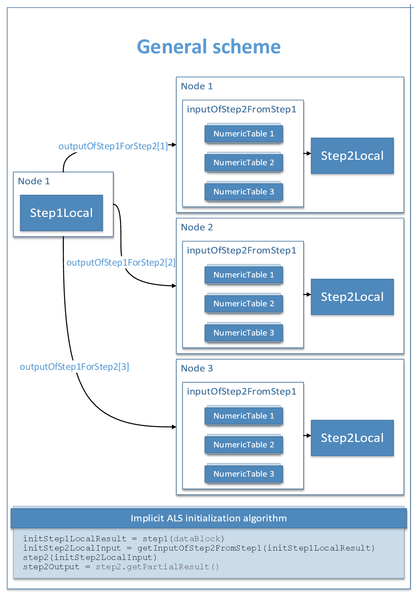
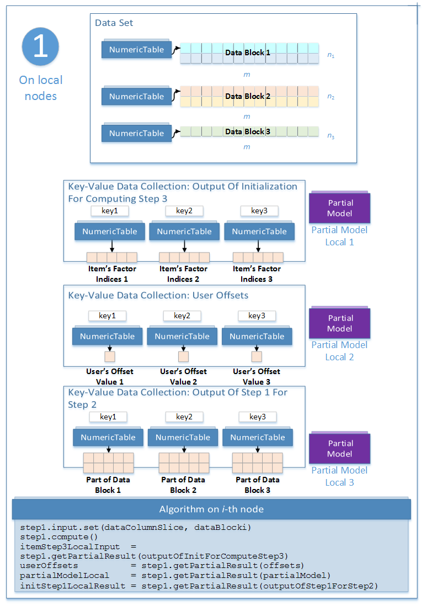

.. ******************************************************************************
.. * Copyright 2020 Intel Corporation
.. *
.. * Licensed under the Apache License, Version 2.0 (the "License");
.. * you may not use this file except in compliance with the License.
.. * You may obtain a copy of the License at
.. *
.. *     http://www.apache.org/licenses/LICENSE-2.0
.. *
.. * Unless required by applicable law or agreed to in writing, software
.. * distributed under the License is distributed on an "AS IS" BASIS,
.. * WITHOUT WARRANTIES OR CONDITIONS OF ANY KIND, either express or implied.
.. * See the License for the specific language governing permissions and
.. * limitations under the License.
.. *******************************************************************************/

Distributed Processing
======================

The distributed processing mode assumes that the data set R is split in ``nblocks`` blocks across computation nodes.

Parameters
**********

In the distributed processing mode, initialization of item factors for the implicit ALS algorithm has the following parameters:

.. tabularcolumns::  |\Y{0.2}|\Y{0.2}|\Y{0.6}|

.. list-table:: Parameters for Implicit Alternating Least Squares Initialization (Distributed Processing)
   :widths: 10 20 30
   :header-rows: 1
   :align: left
   :class: longtable

   * - Parameter
     - Default Value
     - Description
   * - ``algorithmFPType``
     - ``float``
     - The floating-point type that the algorithm uses for intermediate computations. Can be ``float`` or ``double``.
   * - ``method``
     - ``fastCSR``
     - Performance-oriented computation method for CSR numeric tables, the only method supported by the algorithm.
   * - ``nFactors``
     - :math:`10`
     - The total number of factors.
   * - ``fullNUsers``
     - :math:`0`
     - The total number of users :math:`m`.
   * - ``partition``
     - Not applicable
     - A numeric table of size either :math:`1 \times 1` that provides the number of input data parts or :math:`(\mathrm{nblocks} + 1) \times 1`,
       where ``nblocks`` is the number of input data parts, and the :math:`i`-th element contains the offset
       of the transposed :math:`i`-th data part to be computed by the initialization algorithm.
   * - ``engine``
     - `SharePtr< engines:: mt19937:: Batch>()`
     - Pointer to the random number generator engine that is used internally at the initialization step.

To initialize the implicit ALS algorithm in the distributed processing mode, use the one-step process illustrated by the following diagram for :math:`\mathrm{nblocks} = 3`:

    Implicit Alternating Least Squares Initialization: General Schema of Distributed Processing

.. _implicit_als_distributed_init_step_1:

Step 1 - on Local Nodes
***********************

    Implicit Alternating Least Squares Initialization: Distributed Processing, Step 1 - on Local Nodes

Input
-----

In the distributed processing mode, initialization of item factors for the implicit ALS algorithm accepts the input described below.
Pass the ``Input ID`` as a parameter to the methods that provide input for your algorithm.
For more details, see :ref:`algorithms`.

.. tabularcolumns::  |\Y{0.2}|\Y{0.8}|

.. list-table:: Input for Implicit Alternating Least Squares Initialization (Distributed Processing, Step 1)
   :widths: 10 60
   :header-rows: 1

   * - Input ID
     - Input
   * - ``dataColumnSlice``
     - An :math:`n_i \times m` numeric table with the part of the input data set.
       Each node holds :math:`n_i` rows of the full transposed input data set :math:`R^T`.

       The input should be an object of ``CSRNumericTable`` class.

Output
------

In the distributed processing mode, initialization of item factors for the implicit ALS algorithm calculates the results described below.
Pass the ``Partial Result ID`` as a parameter to the methods that access the results of your algorithm.
Partial results that correspond to the ``outputOfInitForComputeStep3`` and ``offsets`` Partial Result IDs
should be transferred to :ref:`Step 3 of the distributed ALS training algorithm <implicit_als_distributed_training_step_3>`.

Output of Initialization for Computing Step 3 (``outputOfInitForComputeStep3``) is a key-value data collection
that maps components of the partial model on the :math:`i`-th node to all local nodes.
Keys in this data collection are indices of the nodes and the value that corresponds to each key :math:`i`
is a numeric table that contains indices of the factors of the items to be transferred to the :math:`i`-th node
on :ref:`Step 3 of the distributed ALS training algorithm <implicit_als_distributed_training_step_3>`.

User Offsets (``offsets``) is a key-value data collection,
where the keys are indices of the nodes and the value that correspond to the key :math:`i` is a numeric table of size :math:`1 \times 1`
that contains the value of the starting offset of the user factors stored on the :math:`i`-th node.

For more details, see :ref:`algorithms`.

.. tabularcolumns::  |\Y{0.2}|\Y{0.8}|

.. list-table:: Output for Implicit Alternating Least Squares Initialization (Distributed Processing, Step 1)
   :widths: 10 60
   :header-rows: 1
   :class: longtable

   * - Partial Result ID
     - Result
   * - ``partialModel``
     -  The model with initialized item factors. The result can only be an object of the ``PartialModel`` class.
   * - ``outputOfInitForComputeStep3``
     - A key-value data collection that maps components of the partial model to the local nodes.
   * - ``offsets``
     - A key-value data collection of size ``nblocks`` that holds the starting offsets of the factor indices on each node.
   * - ``outputOfStep1ForStep2``
     - A key-value data collection of size ``nblocks`` that contains the parts of the input numeric table:
       :math:`j` -th element of this collection is a numeric table of size :math:`m_j \times n_i`,
       where :math:`m_1 + \ldots + m_{\mathrm{nblocks}} = m` and the values :math:`m_j` are defined by the ``partition`` parameter.

.. _implicit_als_distributed_init_step_2:

Step 2 - on Local Nodes
***********************

.. figure:: images/implicit-als-distributed-init-step-2.png
    :width: 600
    :align: center
    :alt:

    Implicit Alternating Least Squares Initialization: Distributed Processing, Step 2 - on Local Nodes

Input
-----

This step uses the results of the previous step.

.. tabularcolumns::  |\Y{0.2}|\Y{0.8}|

.. list-table:: Input for Implicit Alternating Least Squares Initialization (Distributed Processing, Step 3)
   :widths: 10 60
   :header-rows: 1

   * - Input ID
     - Input
   * - ``inputOfStep2FromStep1``
     - A key-value data collection of size nblocks that contains the parts of the input data set:
       :math:`i` -th element of this collection is a numeric table of size :math:`m_i \times n_i`.
       Each numeric table in the collection should be an object of CSRNumericTable class.

Output
------

In this step, implicit ALS initialization calculates the partial results described below.
Pass the ``Partial Result ID`` as a parameter to the methods that access the results of your algorithm.
Partial results that correspond to the ``outputOfInitForComputeStep3`` and ``offsets`` Partial Result IDs
should be transferred to :ref:`Step 3 of the distributed ALS training algorithm <implicit_als_distributed_training_step_3>`.

Output of Initialization for Computing Step 3 (``outputOfInitForComputeStep3``) is a key-value data collection
that maps components of the partial model on the :math:`i`-th node to all local nodes.
Keys in this data collection are indices of the nodes and the value that corresponds to each key i
is a numeric table that contains indices of the user factors to be transferred to the i-th node
on :ref:`Step 3 of the distributed ALS training algorithm <implicit_als_distributed_training_step_3>`.

Item Offsets (``offsets``) is a key-value data collection,
where the keys are indices of the nodes and the value that correspond to the key :math:`i` is a numeric table of size :math:`1 \times 1`
that contains the value of the starting offset of the item factors stored on the :math:`i`-th node.

For more details, see :ref:`algorithms`.

.. tabularcolumns::  |\Y{0.2}|\Y{0.8}|

.. list-table:: Output for Implicit Alternating Least Squares Initialization (Distributed Processing, Step 2)
   :widths: 10 60
   :header-rows: 1
   :class: longtable

   * - Partial Result ID
     - Result
   * - ``dataRowSlice``
     - An :math:`m_j \times n` numeric table with the mining data.
       :math:`j`-th node gets :math:`m_j` rows of the full input data set :math:`R`.
   * - ``outputOfInitForComputeStep3``
     - A key-value data collection that maps components of the partial model to the local nodes.
   * - ``offsets``
     - A key-value data collection of size ``nblocks`` that holds the starting offsets of the factor indices on each node.
    