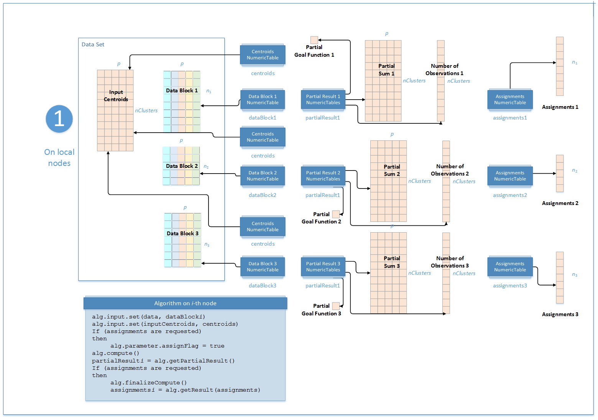
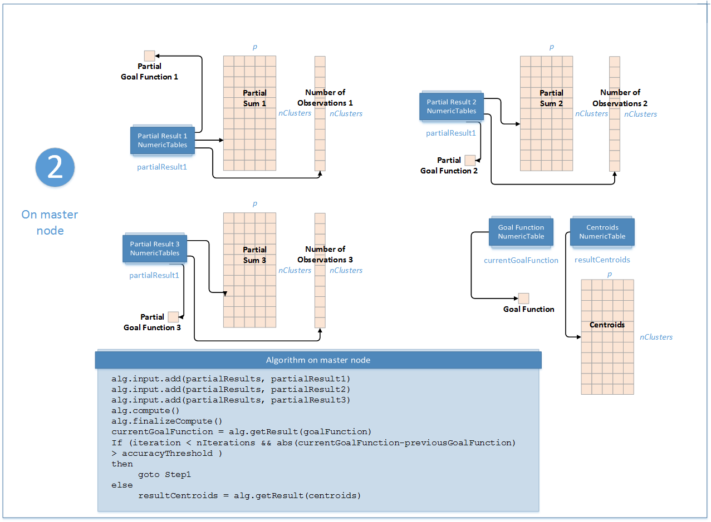

.. ******************************************************************************
.. * Copyright 2020 Intel Corporation
.. *
.. * Licensed under the Apache License, Version 2.0 (the "License");
.. * you may not use this file except in compliance with the License.
.. * You may obtain a copy of the License at
.. *
.. *     http://www.apache.org/licenses/LICENSE-2.0
.. *
.. * Unless required by applicable law or agreed to in writing, software
.. * distributed under the License is distributed on an "AS IS" BASIS,
.. * WITHOUT WARRANTIES OR CONDITIONS OF ANY KIND, either express or implied.
.. * See the License for the specific language governing permissions and
.. * limitations under the License.
.. *******************************************************************************/

Distributed Processing
**********************

This mode assumes that the data set is split into ``nblocks`` blocks across computation nodes.

Algorithm Parameters
++++++++++++++++++++

The K-Means clustering algorithm in the distributed processing mode has the following parameters:

.. tabularcolumns::  |\Y{0.15}|\Y{0.15}|\Y{0.7}|

.. list-table:: Algorithm Parameters for K-Means Computation (Distributed Processing)
   :header-rows: 1
   :widths: 10 10 60
   :align: left
   :class: longtable

   * - Parameter
     - Default Value
     - Description
   * - ``computeStep``
     - Not applicable
     - The parameter required to initialize the algorithm. Can be:

       - ``step1Local`` - the first step, performed on local nodes
       - ``step2Master`` - the second step, performed on a master node

   * - ``algorithmFPType``
     - ``float``
     - The floating-point type that the algorithm uses for intermediate computations. Can be ``float`` or ``double``.
   * - ``method``
     - ``defaultDense``
     - Available computation methods for K-Means clustering:

       - ``defaultDense`` - implementation of Lloyd's algorithm
       - ``lloydCSR`` - implementation of Lloyd's algorithm for CSR numeric tables

   * - ``nClusters``
     - Not applicable
     - The number of clusters. Required to initialize the algorithm.
   * - ``gamma``
     - :math:`1.0`
     - The weight to be used in distance calculation for binary categorical features.
   * - ``distanceType``
     - ``euclidean``
     - The measure of closeness between points (observations) being clustered. The only distance type supported so far is the Euclidean distance.
   * - ``assignFlag``
     - ``false``
     - A flag that enables computation of assignments, that is, assigning cluster indices to respective observations.

To compute K-Means clustering in the distributed processing mode, use the general schema described in Algorithms as follows:

.. _kmeans_computation_step_1:

Step 1 - on Local Nodes
+++++++++++++++++++++++

    K-Means Computation: Distributed Processing, Step 1 - on Local Nodes

In this step, the K-Means clustering algorithm accepts the input described below.
Pass the ``Input ID`` as a parameter to the methods that provide input for your algorithm.
For more details, see :ref:`algorithms`.

.. tabularcolumns::  |\Y{0.2}|\Y{0.8}|

.. list-table:: Input for K-Means Computation (Distributed Processing, Step 1)
   :header-rows: 1
   :widths: 10 60
   :align: left
   :class: longtable

   * - Input ID
     - Input
   * - ``data``
     - Pointer to the :math:`n_i \times p` numeric table that represents the :math:`i`-th data block on the local node.
       The input can be an object of any class derived from ``NumericTable``.
   * - ``inputCentroids``
     - Pointer to the :math:`\mathrm{nClusters} \times p` numeric table with the initial cluster centroids.
       This input can be an object of any class derived from NumericTable.

In this step, the K-Means clustering algorithm calculates the partial results and results described below.
Pass the ``Partial Result ID`` or ``Result ID`` as a parameter to the methods that access the results of your algorithm.
For more details, see :ref:`algorithms`.

.. tabularcolumns::  |\Y{0.2}|\Y{0.8}|

.. list-table:: Partial Results for K-Means Computation (Distributed Processing, Step 1)
   :header-rows: 1
   :widths: 10 60
   :align: left
   :class: longtable

   * - Partial Result ID
     - Result
   * - ``nObservations``
     - Pointer to the :math:`\mathrm{nClusters} \times 1` numeric table that contains
       the number of observations assigned to the clusters on local node.

       .. note::
            By default, this result is an object of the ``HomogenNumericTable`` class,
            but you can define this result as an object of any class derived from ``NumericTable`` except ``CSRNumericTable``.
   * - ``partialSums``
     - Pointer to the :math:`\mathrm{nClusters} \times p` numeric table with
       partial sums of observations assigned to the clusters on the local node.

       .. note::
            By default, this result is an object of the ``HomogenNumericTable`` class,
            but you can define the result as an object of any class derived from ``NumericTable``
            except ``PackedTriangularMatrix``, ``PackedSymmetricMatrix``, and ``CSRNumericTable``.
   * - ``partialObjectiveFunction``
     - Pointer to the :math:`1 \times 1` numeric table that contains the value of the partial objective function
       for observations processed on the local node.

       .. note::
            By default, this result is an object of the ``HomogenNumericTable`` class,
            but you can define this result as an object of any class derived from ``NumericTable`` except ``CSRNumericTable``.
   * - ``partialCandidatesDistances``
     - Pointer to the :math:`\mathrm{nClusters} \times 1` numeric table that contains the value of the ``nClusters``
       largest objective function for the observations processed on the local node and stored in descending order.

       .. note::
           By default, this result if an object of the ``HomogenNumericTable`` class,
           but you can define this result as an object of any class derived from ``NumericTable``
           except ``PackedTriangularMatrix``, ``PackedSymmetricMatrix``, ``CSRNumericTable``.
   * - ``partialCandidatesCentroids``
     - Pointer to the :math:`\mathrm{nClusters} \times 1` numeric table that contains the observations of the ``nClusters``
       largest objective function value processed on the local node and stored in descending order of the objective function.

       .. note::
            By default, this result if an object of the ``HomogenNumericTable`` class,
            but you can define this result as an object of any class derived from ``NumericTable``
            except ``PackedTriangularMatrix``, ``PackedSymmetricMatrix``, ``CSRNumericTable``.

.. tabularcolumns::  |\Y{0.2}|\Y{0.8}|

.. list-table:: Output for K-Means Computation (Distributed Processing, Step 1)
   :header-rows: 1
   :widths: 10 60
   :align: left

   * - Result ID
     - Result
   * - ``assignments``
     - Use when ``assignFlag`` = ``true``. Pointer to the :math:`n_i \times 1` numeric table
       with 32-bit integer assignments of cluster indices to feature vectors in the input data on the local node.

       .. note::
            By default, this result is an object of the ``HomogenNumericTable`` class,
            but you can define this result as an object of any class derived from ``NumericTable``
            except ``PackedTriangularMatrix``, ``PackedSymmetricMatrix``, and ``CSRNumericTable``.

.. _kmeans_computation_step_2:

Step 2 - on Master Node
+++++++++++++++++++++++

    K-Means Computation: Distributed Processing, Step 2 - on Master Node

In this step, the K-Means clustering algorithm accepts the input from each local node described below.
Pass the ``Input ID`` as a parameter to the methods that provide input for your algorithm.
For more details, see :ref:`algorithms`.

.. tabularcolumns::  |\Y{0.2}|\Y{0.8}|

.. list-table:: Input for K-Means Computation (Distributed Processing, Step 2)
   :header-rows: 1
   :widths: 10 60
   :align: left

   * - Input ID
     - Input
   * - ``partialResuts``
     - A collection that contains results computed in :ref:`Step 1 <kmeans_computation_step_1>` on local nodes.

In this step, the K-Means clustering algorithm calculates the results described below.
Pass the ``Result ID`` as a parameter to the methods that access the results of your algorithm.
For more details, see :ref:`algorithms`.

.. tabularcolumns::  |\Y{0.2}|\Y{0.8}|

.. list-table:: Output for K-Means Computation (Distributed Processing, Step 2)
   :header-rows: 1
   :widths: 10 60
   :align: left
   :class: longtable

   * - Result ID
     - Result
   * - ``centroids``
     - Pointer to the :math:`\mathrm{nClusters} \times p` numeric table with centroids.

       .. note::

          By default, this result is an object of the ``HomogenNumericTable`` class,
          but you can define the result as an object of any class derived from ``NumericTable``
          except ``PackedTriangularMatrix``, ``PackedSymmetricMatrix``, and ``CSRNumericTable``.
   * - ``objectiveFunction``
     - Pointer to the :math:`1 \times 1` numeric table that contains the value of the objective function.

       .. note::
            By default, this result is an object of the ``HomogenNumericTable`` class,
            but you can define this result as an object of any class derived from ``NumericTable`` except ``CSRNumericTable``.

.. important::
    The algorithm computes assignments using input centroids.
    Therefore, to compute assignments using final computed centroids, after the last call to ``Step2compute()`` method on the master node,
    on each local node set assignFlag to true and do one additional call to ``Step1compute()`` and ``finalizeCompute()`` methods.
    Always set assignFlag to true and call ``finalizeCompute()`` to obtain assignments in each step.

.. note::
    To compute assignments using original ``inputCentroids`` on the given node,
    you can use K-Means clustering algorithm in the batch processing mode with the subset of the data available on this node.
    See :ref:`kmeans_computation_batch` for more details.
