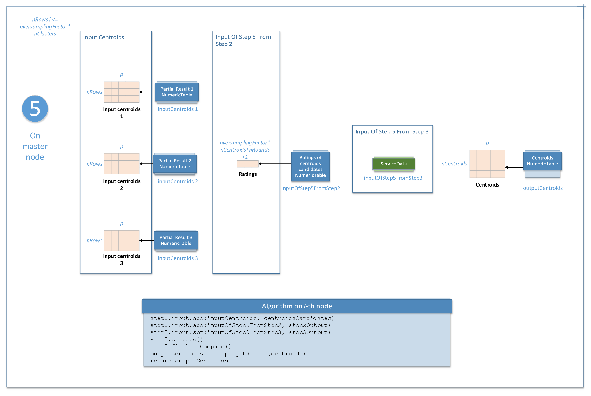

.. Copyright 2020 Intel Corporation
..
.. Licensed under the Apache License, Version 2.0 (the "License");
.. you may not use this file except in compliance with the License.
.. You may obtain a copy of the License at
..
..     http://www.apache.org/licenses/LICENSE-2.0
..
.. Unless required by applicable law or agreed to in writing, software
.. distributed under the License is distributed on an "AS IS" BASIS,
.. WITHOUT WARRANTIES OR CONDITIONS OF ANY KIND, either express or implied.
.. See the License for the specific language governing permissions and
.. limitations under the License.

Distributed Processing
**********************

This mode assumes that the data set is split into ``nblocks`` blocks across computation nodes.

Parameters
++++++++++

Centroid initialization for K-Means clustering in the distributed processing mode has the following parameters:

.. tabularcolumns::  |\Y{0.15}|\Y{0.15}|\Y{0.15}|\Y{0.55}|

.. list-table:: Algorithm Parameters for K-Means Initialization (Distributed Processing)
   :widths: 10 10 10 30
   :header-rows: 1
   :class: longtable

   * - Parameter
     - Method
     - Default Valude
     - Description
   * - ``computeStep``
     - any
     - Not applicable
     - The parameter required to initialize the algorithm. Can be:

       - ``step1Local`` - the first step, performed on local nodes. Applicable for all methods.
       - ``step2Master`` - the second step, performed on a master node. Applicable for deterministic and random methods only.
       - ``step2Local`` - the second step, performed on local nodes. Applicable for ``plusPlus`` and ``parallelPlus`` methods only.
       - ``step3Master`` - the third step, performed on a master node. Applicable for ``plusPlus`` and ``ParallelPlus`` methods only.
       - ``step4Local`` - the forth step, performed on local nodes. Applicable for ``plusPlus`` and ``parallelPlus`` methods only.
       - ``step5Master`` - the fifth step, performed on a master node. Applicable for ``plusPlus`` and ``parallelPlus`` methods only.
   * - ``algorithmFPType``
     - any
     - ``float``
     - The floating-point type that the algorithm uses for intermediate computations. Can be ``float`` or ``double``.
   * - ``method``
     - Not applicable
     - ``defaultDense``
     - Available initialization methods for K-Means clustering:

       - ``defaultDense`` - uses first nClusters feature vectors as initial centroids
       - ``deterministicCSR`` - uses first nClusters feature vectors as initial centroids for data in a CSR numeric table
       - ``randomDense`` - uses random nClusters feature vectors as initial centroids
       - ``randomCSR`` - uses random nClusters feature vectors as initial centroids for data in a CSR numeric table
       - ``plusPlusDense`` - uses K-Means++ algorithm [Arthur2007]_
       - ``plusPlusCSR`` - uses K-Means++ algorithm for data in a CSR numeric table
       - ``parallelPlusDense`` - uses parallel K-Means++ algorithm [Bahmani2012]_
       - ``parallelPlusCSR`` - uses parallel K-Means++ algorithm for data in a CSR numeric table

       For more details, see the algorithm description.
   * - ``nClusters``
     - any
     - Not applicable
     - The number of centroids. Required.
   * - ``nRowsTotal``
     - any
     - :math:`0`
     - The total number of rows in all input data sets on all nodes. Required in the distributed processing mode in the first step.
   * - ``offset``
     - any
     - Not applicable
     - Offset in the total data set specifying the start of a block stored on a given local node. Required.
   * - ``oversamplingFactor``
     -
       * ``parallelPlusDense``
       * ``parallelPlusCSR``
     - :math:`0.5`
     - A fraction of ``nClusters`` in each of ``nRounds`` of parallel K-Means++.
       :math:`L = \mathrm{nClusters}*\mathrm{oversamplingFactor}` points are sampled in a round.
       For details, see [Bahmani2012]_, section 3.3.
   * - ``nRounds``
     -
       * ``parallelPlusDense``
       * ``parallelPlusCSR``
     - :math:`5`
     - The number of rounds for parallel K-Means++. :math:`L * \mathrm{nRounds}` must be greater than ``nClusters``.
       For details, see [Bahmani2012]_, section 3.3.
   * - ``firstIteration``
     -
       * ``parallelPlusDense``
       * ``parallelPlusCSR``
       * ``plusPlusDense``
       * ``plusPlusCSR``
     - ``false``
     - Set to true if ``step2Local`` is called for the first time.
   * - ``outputForStep5Required``
     -
       * ``parallelPlusDense``
       * ``parallelPlusCSR``
     - ``false``
     - Set to true if ``step4Local`` is called on the last iteration of the
       :ref:`Step 2 <kmeans_init_step_2_master>` - :ref:`Step 4 <kmeans_init_step_4>` loop.

Centroid initialization for K-Means clustering follows the general schema described in :ref:`algorithms`.

.. tabs::

    .. tab:: ``plusPlus`` methods

        .. figure:: images/kmeans-distributed-init-plusPlus-methods.png
           :alt:

           K-Means Centroid Initialization with ``plusPlus`` methods: Distributed Processing

    .. tab:: ``parrallelPlus`` methods

        .. figure:: images/kmeans-distributed-init-parallelPlus-methods.png
           :alt:

           K-Means Centroid Initialization with ``parrallelPlus`` methods: Distributed Processing

.. _kmeans_init_step_1:

Step 1 - on Local Nodes (``deterministic``, ``random``, ``plusPlus``, and ``parallelPlus`` methods)
+++++++++++++++++++++++++++++++++++++++++++++++++++++++++++++++++++++++++++++++++++++++++++++++++++

.. tabs::

    .. tab:: ``plusPlus`` methods

        .. figure:: images/kmeans-distributed-init-step-1-plusPlus-methods.png
           :alt:

           K-Means Centroid Initialization with ``plusPlus`` methods: Distributed Processing, Step 1 - on Local Nodes

    .. tab:: ``parrallelPlus`` methods

        .. figure:: images/kmeans-distributed-init-step-1-parallelPlus-methods.png
           :alt:

           K-Means Centroid Initialization with ``parrallelPlus`` methods: Distributed Processing, Step 1 - on Local Nodes

In this step, centroid initialization for K-Means clustering accepts the input described below.
Pass the ``Input ID`` as a parameter to the methods that provide input for your algorithm.
For more details, see :ref:`algorithms`.

.. tabularcolumns::  |\Y{0.2}|\Y{0.8}|

.. list-table:: Input for K-Means Initialization (Distributed Processing, Step 1)
   :header-rows: 1
   :widths: 10 60
   :align: left

   * - Input ID
     - Input
   * - ``data``
     - Pointer to the :math:`n_i \times p` numeric table that represents the :math:`i`-th data block on the local node.

       .. note::

          While the input for ``defaultDense``, ``randomDense``, ``plusPlusDense``, and ``parallelPlusDense`` methods
          can be an object of any class derived from ``NumericTable``,
          the input for ``deterministicCSR``, ``randomCSR``, ``plusPlusCSR``, and ``parallelPlusCSR`` methods
          can only be an object of the ``CSRNumericTable`` class.

In this step, centroid initialization for K-Means clustering calculates the results described below.
Pass the ``Result ID`` as a parameter to the methods that access the results of your algorithm.
For more details, see :ref:`algorithms`.

.. tabularcolumns::  |\Y{0.2}|\Y{0.8}|

.. list-table:: Output for K-Means Initialization (Distributed Processing, Step 1)
   :header-rows: 1
   :widths: 10 60
   :align: left

   * - Result ID
     - Result
   * - ``partialCentroids``
     - Pointer to the :math:`\mathrm{nClusters} \times p` numeric table with the centroids computed on the local node.

       .. note::

          By default, this result is an object of the ``HomogenNumericTable`` class,
          but you can define the result as an object of any class derived from ``NumericTable``
          except ``PackedTriangularMatrix``, ``PackedSymmetricMatrix``, and ``CSRNumericTable``.

.. _kmeans_init_step_2_master:

Step 2 - on Master Node (``deterministic`` and ``random`` methods)
++++++++++++++++++++++++++++++++++++++++++++++++++++++++++++++++++

This step is applicable for ``deterministic`` and ``random`` methods only.
Centroid initialization for K-Means clustering accepts the input from each local node described below.
Pass the ``Input ID`` as a parameter to the methods that provide input for your algorithm.
For more details, see :ref:`algorithms`.

.. tabularcolumns::  |\Y{0.2}|\Y{0.8}|

.. list-table:: Input for K-Means Initialization (Distributed Processing, Step 2 on Master Node)
   :header-rows: 1
   :widths: 10 60
   :align: left

   * - Input ID
     - Input
   * - ``partialResuts``
     - A collection that contains results computed in :ref:`Step 1 <kmeans_init_step_1>`
       on local nodes (two numeric tables from each local node).

In this step, centroid initialization for K-Means clustering calculates the results described below.
Pass the ``Result ID`` as a parameter to the methods that access the results of your algorithm.
For more details, see :ref:`algorithms`.

.. tabularcolumns::  |\Y{0.2}|\Y{0.8}|

.. list-table:: Output for K-Means Initialization (Distributed Processing, Step 2 on Master Node)
   :header-rows: 1
   :widths: 10 60
   :align: left

   * - Result ID
     - Result
   * - ``centroids``
     - Pointer to the :math:`\mathrm{nClusters} \times p` numeric table with centroids.

       .. note::

          By default, this result is an object of the ``HomogenNumericTable`` class,
          but you can define the result as an object of any class derived from ``NumericTable``
          except ``PackedTriangularMatrix``, ``PackedSymmetricMatrix``, and ``CSRNumericTable``.

.. _kmeans_init_step_2_local:

Step 2 - on Local Nodes (``plusPlus`` and ``parallelPlus`` methods)
+++++++++++++++++++++++++++++++++++++++++++++++++++++++++++++++++++

.. tabs::

    .. tab:: ``plusPlus`` methods

        .. figure:: images/kmeans-distributed-init-step-2-plusPlus-methods.png
           :alt:

           K-Means Centroid Initialization with ``plusPlus`` methods: Distributed Processing, Step 2 - on Local Nodes

    .. tab:: ``parrallelPlus`` methods

        .. figure:: images/kmeans-distributed-init-step-2-parallelPlus-methods.png
           :alt:

           K-Means Centroid Initialization with ``parrallelPlus`` methods: Distributed Processing, Step 2 - on Local Nodes

This step is applicable for ``plusPlus`` and ``parallelPlus`` methods only.
Centroid initialization for K-Means clustering accepts the input from each local node described below.
Pass the ``Input ID`` as a parameter to the methods that provide input for your algorithm.
For more details, see :ref:`algorithms`.

.. tabularcolumns::  |\Y{0.2}|\Y{0.8}|

.. list-table:: Input for K-Means Initialization (Distributed Processing, Step 1 on Local Nodes)
   :header-rows: 1
   :widths: 10 60
   :align: left
   :class: longtable

   * - Input ID
     - Input
   * - ``data``
     - Pointer to the :math:`n_i \times p` numeric table that represents the :math:`i`-th data block on the local node.

       .. note::

          While the input for ``defaultDense``, ``randomDense``, ``plusPlusDense``, and ``parallelPlusDense`` methods
          can be an object of any class derived from ``NumericTable``,
          the input for ``deterministicCSR``, ``randomCSR``, ``plusPlusCSR``, and ``parallelPlusCSR`` methods
          can only be an object of the ``CSRNumericTable`` class.

   * - ``inputOfStep2``
     - Pointer to the :math:`m \times p` numeric table with the centroids calculated in the previous steps
       (:ref:`Step 1 <kmeans_init_step_1>` or :ref:`Step 4 <kmeans_init_step_4>`).

       The value of :math:`m` is defined by the method and iteration of the algorithm:

       - ``plusPlus`` method: :math:`m = 1`
       - ``parallelPlus`` method:

         - :math:`m = 1` for the first iteration of the Step 2 - Step 4 loop
         - :math:`m = L = \mathrm{nClusters} * \mathrm{oversamplingFactor}` for other iterations

       This input can be an object of any class derived from ``NumericTable``,
       except ``CSRNumericTable``, ``PackedTriangularMatrix``, and ``PackedSymmetricMatrix``.

   * - ``internalInput``
     - Pointer to the ``DataCollection`` object with the internal data of the distributed algorithm
       used by its local nodes in :ref:`Step 2 <kmeans_init_step_2_local>` and :ref:`Step 4 <kmeans_init_step_4>`.
       The ``DataCollection`` is created in :ref:`Step 2 <kmeans_init_step_2_local>` when ``firstIteration`` is set to ``true``,
       and then the ``DataCollection`` should be set from the partial result as an input for next local steps
       (:ref:`Step 2 <kmeans_init_step_2_local>` and :ref:`Step 4 <kmeans_init_step_4>`).

In this step, centroid initialization for K-Means clustering calculates the results described below.
Pass the ``Result ID`` as a parameter to the methods that access the results of your algorithm.
For more details, see :ref:`algorithms`.

.. tabularcolumns::  |\Y{0.2}|\Y{0.8}|

.. list-table:: Output for K-Means Initialization (Distributed Processing, Step 2 on Local Nodes)
   :header-rows: 1
   :widths: 10 60
   :align: left
   :class: longtable

   * - Result ID
     - Result
   * - ``outputOfStep2ForStep3``
     - Pointer to the :math:`1 \times 1` numeric table that contains the overall error accumulated on the node.
       For a description of the overall error, see :ref:`K-Means Clustering Details <kmeans_details>`.
   * - ``outputOfStep2ForStep5``
     - Applicable for ``parallelPlus`` methods only and calculated when ``outputForStep5Required`` is set to ``true``.
       Pointer to the :math:`1 \times m` numeric table with the ratings of centroid candidates computed on the previous steps
       and :math:`m = \mathrm{oversamplingFactor} * \mathrm{nClusters} * \mathrm{nRounds} + 1`.
       For a description of ratings, see :ref:`K-Means Clustering Details <kmeans_details>`.

.. note::

    By default, these results are objects of the ``HomogenNumericTable`` class,
    but you can define the result as an object of any class derived from ``NumericTable``
    except ``PackedTriangularMatrix``, ``PackedSymmetricMatrix``, and ``CSRNumericTable``.

.. _kmeans_init_step_3:

Step 3 - on Master Node (``plusPlus`` and ``parallelPlus`` methods)
+++++++++++++++++++++++++++++++++++++++++++++++++++++++++++++++++++

.. tabs::

    .. tab:: ``plusPlus`` methods

        .. figure:: images/kmeans-distributed-init-step-3-plusPlus-methods.png
           :alt:

           K-Means Centroid Initialization with ``plusPlus`` methods: Distributed Processing, Step 3 - on Master Node

    .. tab:: ``parrallelPlus`` methods

        .. figure:: images/kmeans-distributed-init-step-3-parallelPlus-methods.png
           :alt:

           K-Means Centroid Initialization with ``parrallelPlus`` methods: Distributed Processing, Step 3 - on Master Node

This step is applicable for plusPlus and parallelPlus methods only.
Centroid initialization for K-Means clustering accepts the input from each local node described below.
Pass the ``Input ID`` as a parameter to the methods that provide input for your algorithm.
For more details, see :ref:`algorithms`.

.. tabularcolumns::  |\Y{0.2}|\Y{0.8}|

.. list-table:: Input for K-Means Initialization (Distributed Processing, Step 3)
   :header-rows: 1
   :widths: 10 60
   :align: left

   * - Input ID
     - Input
   * - ``inputOfStep3FromStep2``
     - A key-value data collection that maps parts of the accumulated error to the local nodes:
       :math:`i`-th element of this collection is a numeric table that contains overall error accumulated on the :math:`i`-th node.

In this step, centroid initialization for K-Means clustering calculates the results described below.
Pass the ``Result ID`` as a parameter to the methods that access the results of your algorithm.
For more details, see :ref:`algorithms`.

.. tabularcolumns::  |\Y{0.2}|\Y{0.8}|

.. list-table:: Output for K-Means Initialization (Distributed Processing, Step 3)
   :header-rows: 1
   :widths: 10 60
   :align: left
   :class: longtable

   * - Result ID
     - Result
   * - ``outputOfStep3ForStep4``
     - A key-value data collection that maps the input from :ref:`Step 4 <kmeans_init_step_4>` to local nodes:
       :math:`i`-th element of this collection is a numeric table that contains the input from
       :ref:`Step 4 <kmeans_init_step_4>` on the i-th node.

       Note that :ref:`Step 3 <kmeans_init_step_3>` may produce no input for :ref:`Step 4 <kmeans_init_step_4>` on some local nodes,
       which means the collection may not contain the :math:`i`-th node entry.
       The single element of this numeric table :math:`v \leq \Phi_X(C)`, where the overall error :math:`\Phi_X(C)` calculated on the node.
       For a description of the overall error, see :ref:`K-Means Clustering Details <kmeans_details>`.

       This value defines the probability to sample a new centroid on the :math:`i`-th node.
   * - ``outputOfStep3ForStep5``
     - Applicable for parallelPlus methods only. Pointer to the service data to be used in :ref:`Step 5 <kmeans_init_step_5>`.

.. _kmeans_init_step_4:

Step 4 - on Local Nodes (``plusPlus`` and ``parallelPlus`` methods)
+++++++++++++++++++++++++++++++++++++++++++++++++++++++++++++++++++

.. tabs::

    .. tab:: ``plusPlus`` methods

        .. figure:: images/kmeans-distributed-init-step-4-plusPlus-methods.png
           :alt:

           K-Means Centroid Initialization with ``plusPlus`` methods: Distributed Processing, Step 4 - on Local Nodes

    .. tab:: ``parrallelPlus`` methods

        .. figure:: images/kmeans-distributed-init-step-4-parallelPlus-methods.png
           :alt:

           K-Means Centroid Initialization with ``parrallelPlus`` methods: Distributed Processing, Step 4 - on Local Nodes

This step is applicable for plusPlus and parallelPlus methods only.
Centroid initialization for K-Means clustering accepts the input from each local node described below.
Pass the ``Input ID`` as a parameter to the methods that provide input for your algorithm.
For more details, see :ref:`algorithms`.

.. tabularcolumns::  |\Y{0.2}|\Y{0.8}|

.. list-table:: Input for K-Means Initialization (Distributed Processing, Step 4)
   :header-rows: 1
   :widths: 10 60
   :align: left
   :class: longtable

   * - Input ID
     - Input
   * - ``data``
     - Pointer to the :math:`n_i \times p` numeric table that represents the :math:`i`-th data block on the local node.

       .. note::

          While the input for ``defaultDense``, ``randomDense``, ``plusPlusDense``, and ``parallelPlusDense`` methods
          can be an object of any class derived from ``NumericTable``,
          the input for ``deterministicCSR``, ``randomCSR``, ``plusPlusCSR``, and ``parallelPlusCSR`` methods
          can only be an object of the ``CSRNumericTable`` class.

   * - ``inputOfStep4FromStep3``
     - Pointer to the :math:`l \times m` numeric table with the values calculated in :ref:`Step 3 <kmeans_init_step_3>`.

       The value of :math:`m` is defined by the method of the algorithm:

       - ``plusPlus`` method: :math:`m = 1`
       - ``parallelPlus`` method: :math:`m \leq L`, :math:`L = \mathrm{nClusters} * \mathrm{oversamplingFactor}`

       This input can be an object of any class derived from ``NumericTable``,
       except ``CSRNumericTable``, ``PackedTriangularMatrix``, and ``PackedSymmetricMatrix``.

   * - ``internalInput``
     - Pointer to the ``DataCollection`` object with the internal data of the distributed algorithm
       used by its local nodes in :ref:`Step 2 <kmeans_init_step_2_local>` and :ref:`Step 4 <kmeans_init_step_4>`.
       The ``DataCollection`` is created in :ref:`Step 2 <kmeans_init_step_2_local>` when ``firstIteration`` is set to ``true``,
       and then the ``DataCollection`` should be set from the partial result as the input for next local steps
       (:ref:`Step 2 <kmeans_init_step_2_local>` and :ref:`Step 4 <kmeans_init_step_4>`).

In this step, centroid initialization for K-Means clustering calculates the results described below.
Pass the ``Result ID`` as a parameter to the methods that access the results of your algorithm.
For more details, see :ref:`algorithms`.

.. tabularcolumns::  |\Y{0.2}|\Y{0.8}|

.. list-table:: Output for K-Means Initialization (Distributed Processing, Step 4)
   :header-rows: 1
   :widths: 10 60
   :align: left

   * - Result ID
     - Result
   * - ``outputOfStep4``
     - Pointer to the :math:`m \times p` numeric table that contains centroids computed on this local node,
       where :math:`m` equals to the one in ``inputOfStep4FromStep3``.

       .. note::

          By default, this result is an object of the ``HomogenNumericTable`` class,
          but you can define the result as an object of any class derived from ``NumericTable``
          except ``CSRNumericTable``, ``PackedTriangularMatrix``, and ``PackedSymmetricMatrix``.

.. _kmeans_init_step_5:

Step 5 - on Master Node (``parallelPlus`` methods)
++++++++++++++++++++++++++++++++++++++++++++++++++

    K-Means Centroid Initialization with ``parrallelPlus`` methods: Distributed Processing, Step 5 - on Master Node

This step is applicable for parallelPlus methods only.
Centroid initialization for K-Means clustering accepts the input from each local node described below.
Pass the ``Input ID`` as a parameter to the methods that provide input for your algorithm.
For more details, see :ref:`algorithms`.

.. tabularcolumns::  |\Y{0.2}|\Y{0.8}|

.. list-table:: Input for K-Means Initialization (Distributed Processing, Step 5)
   :header-rows: 1
   :widths: 10 60
   :align: left
   :class: longtable

   * - Input ID
     - Input
   * - inputCentroids
     - A data collection with the centroids calculated in :ref:`Step 1 <kmeans_init_step_1>` or :ref:`Step 4 <kmeans_init_step_4>`.
       Each item in the collection is the pointer to :math:`m \times p` numeric table,
       where the value of :math:`m` is defined by the method and the iteration of the algorithm:

       ``parallelPlus`` method:

       - :math:`m = 1` for the data added as the output of :ref:`Step 1 <kmeans_init_step_1>`
       - :math:`m \leq L`, :math:`L = \mathrm{nClusters} * \mathrm{oversamplingFactor}`
         for the data added as the output of :ref:`Step 4 <kmeans_init_step_4>`

       Each numeric table can be an object of any class derived from ``NumericTable``,
       except ``CSRNumericTable``, ``PackedTriangularMatrix``, and ``PackedSymmetricMatrix``.

   * - ``inputOfStep5FromStep2``
     - A data collection with the items calculated in :ref:`Step 2 <kmeans_init_step_2_local>` on local nodes.
       For a detailed definition, see ``outputOfStep2ForStep5`` above.
   * - ``inputOfStep5FromStep3``
     - Pointer to the service data generated as the output of :ref:`Step 3 <kmeans_init_step_3>` on master node.
       For a detailed definition, see ``outputOfStep3ForStep5`` above.

In this step, centroid initialization for K-Means clustering calculates the results described below.
Pass the ``Result ID`` as a parameter to the methods that access the results of your algorithm.
For more details, see :ref:`algorithms`.

.. tabularcolumns::  |\Y{0.2}|\Y{0.8}|

.. list-table:: Output for K-Means Initialization (Distributed Processing, Step 5)
   :header-rows: 1
   :widths: 10 60
   :align: left

   * - Result ID
     - Result
   * - ``centroids``
     - Pointer to the :math:`\mathrm{nClusters} \times p` numeric table with centroids.

       .. note::

          By default, this result is an object of the ``HomogenNumericTable`` class,
          but you can define the result as an object of any class derived from ``NumericTable``
          except ``PackedTriangularMatrix``, ``PackedSymmetricMatrix``, and ``CSRNumericTable``.

