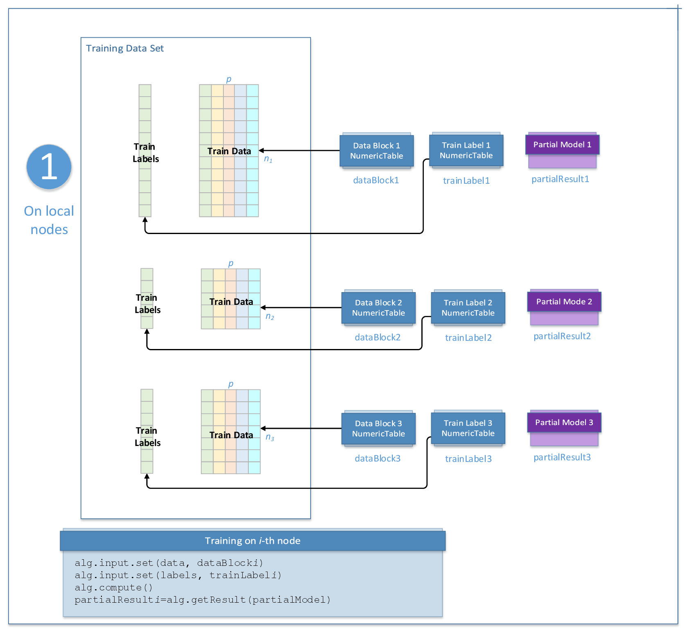
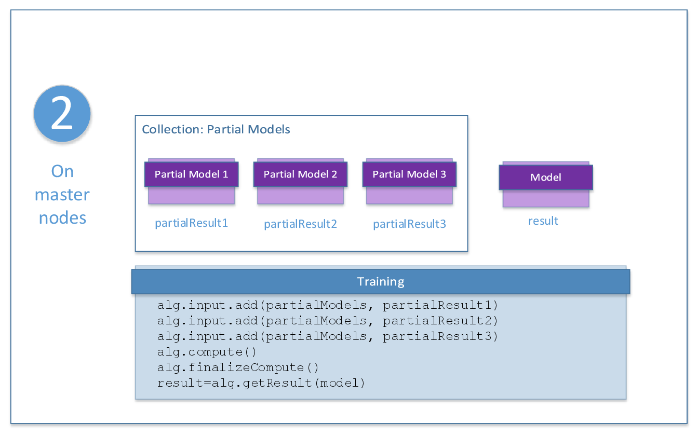

.. ******************************************************************************
.. * Copyright 2020 Intel Corporation
.. *
.. * Licensed under the Apache License, Version 2.0 (the "License");
.. * you may not use this file except in compliance with the License.
.. * You may obtain a copy of the License at
.. *
.. *     http://www.apache.org/licenses/LICENSE-2.0
.. *
.. * Unless required by applicable law or agreed to in writing, software
.. * distributed under the License is distributed on an "AS IS" BASIS,
.. * WITHOUT WARRANTIES OR CONDITIONS OF ANY KIND, either express or implied.
.. * See the License for the specific language governing permissions and
.. * limitations under the License.
.. *******************************************************************************/

Distributed Processing
======================

You can use the Naïve Bayes classifier algorithm in the distributed processing mode only at the training stage.

This computation mode assumes that the data set is split in nblocks blocks across computation nodes.

Training
********

Algorithm Parameters
--------------------

At the training stage, Naïve Bayes classifier in the distributed processing mode has the following parameters:

.. tabularcolumns::  |\Y{0.15}|\Y{0.15}|\Y{0.7}|

.. list-table:: Training Parameters for Naïve Bayes Classifier (Distributed Processing)
   :widths: 10 10 60
   :header-rows: 1
   :class: longtable

   * - Parameter
     - Default Valude
     - Description
   * - ``computeStep``
     - Not applicable
     - The parameter required to initialize the algorithm. Can be:

       - ``step1Local`` - the first step, performed on local nodes
       - ``step2Master`` - the second step, performed on a master node

   * - ``algorithmFPType``
     - ``float``
     - The floating-point type that the algorithm uses for intermediate computations. Can be ``float`` or ``double``.
   * - ``method``
     - ``defaultDense``
     - Available computation methods for the Naïve Bayes classifier:

       - ``defaultDense`` - default performance-oriented method
       - ``fastCSR`` - performance-oriented method for CSR numeric tables

   * - ``nClasses``
     - Not applicable
     - The number of classes. A required parameter.
   * - ``priorClassEstimates``
     - :math:`1/\text{nClasses}`
     - Vector of size ``nClasses`` that contains prior class estimates. The default value applies to each vector element.
   * - ``alpha``
     - :math:`1`
     - Vector of size :math:`p` that contains the imagined occurrences of features. The default value applies to each vector element.

Use the two-step computation schema for Naïve Bayes classifier training in the distributed processing mode, as illustrated below:

.. _naive_bayes_step_1:

Step 1 - on Local Nodes
-----------------------

    Training with Naïve Bayes Classifier: Distributed Processing, Step 1 - on Local Nodes

In this step, Naïve Bayes classifier training accepts the input described below.
Pass the ``Input ID`` as a parameter to the methods that provide input for your algorithm.
For more details, see :ref:`algorithms`.

.. tabularcolumns::  |\Y{0.2}|\Y{0.8}|

.. list-table:: Training Input for Naïve Bayes Classifier (Distributed Processing, Step 1)
   :widths: 10 60
   :header-rows: 1
   :class: longtable

   * - Input ID
     - Input
   * - ``data``
     - Pointer to the :math:`n_i \times p` numeric table that represents the current data block.
   * - ``labels``
     - Pointer to the :math:`n_i \times 1` numeric table with class labels associated with the current data block.

.. note:: These tables can be objects of any class derived from ``NumericTable``.

In this step, Naïve Bayes classifier training calculates the result described below.
Pass the ``Result ID`` as a parameter to the methods that access the results of your algorithm.
For more details, see :ref:`algorithms`.

.. tabularcolumns::  |\Y{0.2}|\Y{0.8}|

.. list-table:: Training Output for Naïve Bayes Classifier (Distributed Processing, Step 1)
   :widths: 10 60
   :header-rows: 1

   * - Result ID
     - Result
   * - ``partialModel``
     - Pointer to the partial Naïve Bayes classifier model that corresponds to the :math:`i`-th data block.

       The result can only be an object of the ``Model`` class.

.. _naive_bayes_step_2:

Step 2 - on Master Node
------------------------

    Trainin with Naïve Bayes Classifier: Distributed Processing, Step 2 - on Master Node

In this step, Naïve Bayes classifier training accepts the input described below.
Pass the ``Input ID`` as a parameter to the methods that provide input for your algorithm.
For more details, see :ref:`algorithms`.

.. tabularcolumns::  |\Y{0.2}|\Y{0.8}|

.. list-table:: Training Input for Naïve Bayes Classifier (Distributed Processing, Step 2)
   :widths: 10 60
   :header-rows: 1

   * - Input ID
     - Input
   * - ``partialModels``
     - A collection of partial models computed on local nodes in :ref:`Step 1 <naive_bayes_step_1>`.

       The collection contains objects of the ``Model`` class.

In this step, Naïve Bayes classifier training calculates the result described below.
Pass the ``Result ID`` as a parameter to the methods that access the results of your algorithm.
For more details, see :ref:`algorithms`.

.. tabularcolumns::  |\Y{0.2}|\Y{0.8}|

.. list-table:: Training Output for Naïve Bayes Classifier (Distributed Processing, Step 2)
   :widths: 10 60
   :header-rows: 1

   * - Result ID
     - Result
   * - ``model``
     - Pointer to the Naïve Bayes classifier model being trained.

       The result can only be an object of the ``Model`` class.
