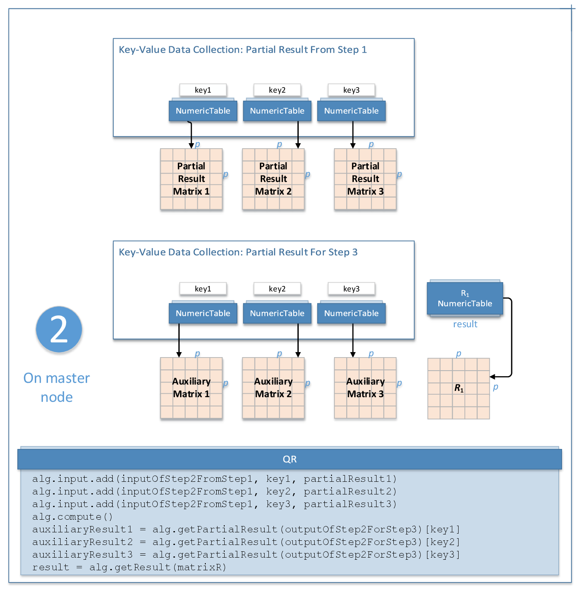

.. ******************************************************************************
.. * Copyright 2020 Intel Corporation
.. *
.. * Licensed under the Apache License, Version 2.0 (the "License");
.. * you may not use this file except in compliance with the License.
.. * You may obtain a copy of the License at
.. *
.. *     http://www.apache.org/licenses/LICENSE-2.0
.. *
.. * Unless required by applicable law or agreed to in writing, software
.. * distributed under the License is distributed on an "AS IS" BASIS,
.. * WITHOUT WARRANTIES OR CONDITIONS OF ANY KIND, either express or implied.
.. * See the License for the specific language governing permissions and
.. * limitations under the License.
.. *******************************************************************************/

Distributed Processing
======================

This mode assumes that the data set is split into ``nblocks`` blocks across computation nodes.

Algorithm Parameters
********************

QR decomposition in the distributed processing mode has the following parameters:

.. tabularcolumns::  |\Y{0.15}|\Y{0.15}|\Y{0.7}|

.. list-table:: Algorithm Parameters for QR Decomposition without Pivoting (Distributed Processing)
   :widths: 10 10 60
   :header-rows: 1
   :class: longtable

   * - Parameter
     - Default Valude
     - Description
   * - ``computeStep``
     - Not applicable
     - The parameter required to initialize the algorithm. Can be:

       - ``step1Local`` - the first step, performed on local nodes
       - ``step2Master`` - the second step, performed on a master node
       - ``step3Local`` - the final step, performed on local nodes

   * - ``algorithmFPType``
     - ``float``
     - The floating-point type that the algorithm uses for intermediate computations. Can be ``float`` or ``double``.
   * - ``method``
     - ``defaultDense``
     - Performance-oriented computation method, the only method supported by the algorithm.

Use the three-step computation schema to compute QR decomposition:

.. _qr_without_pivoting_step_1:

Step 1 - on Local Nodes
***********************

.. figure:: images/qr-without-pivoting-distributed-step-1.png
    :width: 800
    :alt:

    QR Decomposition without Pivoting: Distributed Processing, Step 1 - on Local Nodes

In this step, QR decomposition accepts the input described below.
Pass the ``Input ID`` as a parameter to the methods that provide input for your algorithm.
For more details, see :ref:`algorithms`.

.. tabularcolumns::  |\Y{0.2}|\Y{0.8}|

.. list-table:: Input for QR Decomposition without Pivoting (Distributed Processing, Step 1)
   :widths: 10 60
   :header-rows: 1

   * - Input ID
     - Input
   * - ``data``
     - Pointer to the :math:`n_i \times p` numeric table that represents the :math:`i`-th data block on the local node.
       Note that each data block must have sufficient size: :math:`n_i > p`.

       .. note:: The input can be an object of any class derived from ``NumericTable``.

In this step, QR decomposition calculates the results described below.
Pass the ``Partial Result ID`` as a parameter to the methods that access the results of your algorithm.
For more details, see :ref:`algorithms`.

.. tabularcolumns::  |\Y{0.2}|\Y{0.8}|

.. list-table:: Partial Results for QR Decomposition without Pivoting (Distributed Processing, Step 1)
   :widths: 10 60
   :header-rows: 1
   :class: longtable

   * - Partial Result ID
     - Result
   * - ``outputOfStep1ForStep2``
     - A collection that contains numeric tables each with the partial result to transmit to the master node for :ref:`Step 2 <qr_without_pivoting_step_2>`.

       .. note::

          By default, these tables are objects of the ``HomogenNumericTable`` class,
          but you can define them as objects of any class derived from ``NumericTable``
          except the ``PackedSymmetricMatrix`` class, ``CSRNumericTable`` class, and ``PackedTriangularMatrix`` class with the ``lowerPackedTriangularMatrix`` layout.
   * - ``outputOfStep1ForStep3``
     - A collection that contains numeric tables each with the partial result to keep on the local node for :ref:`Step 3 <qr_without_pivoting_step_3>`.

       .. note::

          By default, these tables are objects of the ``HomogenNumericTable`` class,
          but you can define them as objects of any class derived from ``NumericTable``
          except the ``PackedSymmetricMatrix``, ``PackedTriangularMatrix``, and ``CSRNumericTable``.

.. _qr_without_pivoting_step_2:

Step 2 - on Master Node
***********************

    QR Decomposition without Pivoting: Distributed Processing, Step 2 - on Master Node

In this step, QR decomposition accepts the input from each local node described below.
Pass the ``Input ID`` as a parameter to the methods that provide input for your algorithm.
For more details, see :ref:`algorithms`.

.. tabularcolumns::  |\Y{0.2}|\Y{0.8}|

.. list-table:: Input for QR Decomposition without Pivoting (Distributed Processing, Step 2)
   :widths: 10 60
   :header-rows: 1
   :class: longtable

   * - Input ID
     - Input
   * - ``inputOfStep2FromStep1``
     - A collection that contains results computed in :ref:`Step 1 <qr_without_pivoting_step_1>` on local nodes (``outputOfStep1ForStep2``).

       .. note::

          This collection can contain objects of any class derived from ``NumericTable``
          except the ``PackedSymmetricMatrix`` class and ``PackedTriangularMatrix`` class with the ``lowerPackedTriangularMatrix`` layout.
   * - ``key``
     - A key, a number of type int. Keys enable tracking the order in which partial results from :ref:`Step 1 <qr_without_pivoting_step_1>`
       (``inputOfStep2FromStep1``) come to the master node, so that the partial results computed in :ref:`Step 2 <qr_without_pivoting_step_2>`
       (``outputOfStep2ForStep3``) can be delivered back to local nodes in exactly the same order.

In this step, QR decomposition calculates the results described below.
Pass the ``Result ID`` or ``Partial Result ID`` as a parameter to the methods that access the results of your algorithm.
For more details, see :ref:`algorithms`.

.. tabularcolumns::  |\Y{0.2}|\Y{0.8}|

.. list-table:: Partial Results for QR Decomposition without Pivoting (Distributed Processing, Step 2)
   :widths: 10 60
   :header-rows: 1

   * - Partial Result ID
     - Result
   * - ``outputOfStep2ForStep3``
     - A collection that contains numeric tables to be split across local nodes to compute :math:`Q_1`.

       .. note::

          By default, these tables are objects of the ``HomogenNumericTable`` class,
          but you can define them as objects of any class derived from ``NumericTable``
          except the ``PackedSymmetricMatrix`` class, ``CSRNumericTable`` class, and ``PackedTriangularMatrix`` class with the ``lowerPackedTriangularMatrix`` layout.

.. tabularcolumns::  |\Y{0.2}|\Y{0.8}|

.. list-table:: Output for QR Decomposition without Pivoting (Distributed Processing, Step 2)
   :widths: 10 60
   :header-rows: 1

   * - Result ID
     - Result
   * - ``matrixR``
     - Pointer to the numeric table with the :math:`p \times p` upper triangular matrix :math:`R_1`.

       .. note::

          By default, this result is an object of the ``HomogenNumericTable`` class,
          but you can define the result as an object of any class derived from ``NumericTable``
          except the ``PackedSymmetricMatrix`` class, ``CSRNumericTable`` class, and ``PackedTriangularMatrix`` class with the ``lowerPackedTriangularMatrix`` layout.

.. _qr_without_pivoting_step_3:

Step 3 - on Local Nodes
***********************

.. figure:: images/qr-without-pivoting-distributed-step-3.png
    :width: 800
    :alt:

    QR Decomposition without Pivoting: Distributed Processing, Step 3 - on Local Nodes

In this step, QR decomposition accepts the input described below.
Pass the ``Input ID`` as a parameter to the methods that provide input for your algorithm.
For more details, see :ref:`algorithms`.

.. tabularcolumns::  |\Y{0.2}|\Y{0.8}|

.. list-table:: Input for QR Decomposition without Pivoting (Distributed Processing, Step 3)
   :widths: 10 60
   :header-rows: 1
   :class: longtable

   * - Input ID
     - Input
   * - ``inputOfStep3FromStep1``
     - A collection that contains results computed in :ref:`Step 1 <qr_without_pivoting_step_1>` on local nodes (``outputOfStep1ForStep3``).

       .. note::

          The collection can contain objects of any class derived from ``NumericTable``
          except the ``PackedSymmetricMatrix`` and ``PackedTriangularMatrix``.
   * - ``inputOfStep3FromStep2``
     - A collection that contains results computed in :ref:`Step 2 <qr_without_pivoting_step_2>` on local nodes (``outputOfStep2ForStep3``).

       .. note::

          The collection can contain objects of any class derived from ``NumericTable``
          except the ``PackedSymmetricMatrix`` class and ``PackedTriangularMatrix`` class with the ``lowerPackedTriangularMatrix`` layout.

In this step, QR decomposition calculates the results described below.
Pass the ``Result ID`` as a parameter to the methods that access the results of your algorithm.
For more details, see :ref:`algorithms`.

.. tabularcolumns::  |\Y{0.2}|\Y{0.8}|

.. list-table:: Output for QR Decomposition without Pivoting (Distributed Processing, Step 3)
   :widths: 10 60
   :header-rows: 1

   * - Result ID
     - Result
   * - ``matrixQ``
     - Pointer to the numeric table with the :math:`n \times p` matrix :math:`Q_1`.

       .. note::

          By default, the result is an object of the ``HomogenNumericTable`` class,
          but you can define the result as an object of any class derived from ``NumericTable``
          except ``PackedSymmetricMatrix``, ``PackedTriangularMatrix``, and ``CSRNumericTable``.
