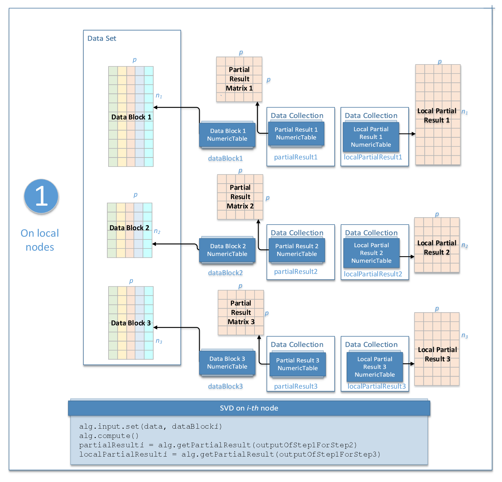

.. Copyright 2020 Intel Corporation
..
.. Licensed under the Apache License, Version 2.0 (the "License");
.. you may not use this file except in compliance with the License.
.. You may obtain a copy of the License at
..
..     http://www.apache.org/licenses/LICENSE-2.0
..
.. Unless required by applicable law or agreed to in writing, software
.. distributed under the License is distributed on an "AS IS" BASIS,
.. WITHOUT WARRANTIES OR CONDITIONS OF ANY KIND, either express or implied.
.. See the License for the specific language governing permissions and
.. limitations under the License.

Distributed Processing
======================

This mode assumes that data set is split in ``nblocks`` blocks across computation nodes.

Algorithm Parameters
********************

The SVD algorithm in the distributed processing mode has the following parameters:

.. tabularcolumns::  |\Y{0.2}|\Y{0.2}|\Y{0.6}|

.. list-table:: Algorithm Parameters for Singular Value Decomposition (Distributed Processing)
   :widths: 10 10 60
   :header-rows: 1
   :class: longtable

   * - Parameter
     - Default Valude
     - Description
   * - ``computeStep``
     - Not applicable
     - The parameter required to initialize the algorithm. Can be:

       - ``step1Local`` - the first step, performed on local nodes
       - ``step2Master`` - the second step, performed on a master node
       - ``step3Local`` - the final step, performed on local nodes

   * - ``algorithmFPType``
     - ``float``
     - The floating-point type that the algorithm uses for intermediate computations. Can be ``float`` or ``double``.
   * - ``method``
     - ``defaultDense``
     - Performance-oriented computation method, the only method supported by the algorithm.
   * - ``leftSingularMatrix``
     - ``requiredInPackedForm``
     - Specifies whether the matrix of left singular vectors is required. Can be:

       - ``notRequired`` - the matrix is not required
       - ``requiredInPackedForm`` - the matrix in the packed format is required
   * - ``rightSingularMatrix``
     - ``requiredInPackedForm``
     - Specifies whether the matrix of right singular vectors is required. Can be:

       - ``notRequired`` - the matrix is not required
       - ``requiredInPackedForm`` - the matrix in the packed format is required


Use the three-step computation schema to compute SVD:

.. _svd_step_1:

Step 1 - on Local Nodes
***********************



    Singular Value Decomposition: Distributed Processing, Step 1 - on Local Nodes

In this step, SVD accepts the input described below.
Pass the ``Input ID`` as a parameter to the methods that provide input for your algorithm.
For more details, see :ref:`algorithms`.

.. tabularcolumns::  |\Y{0.2}|\Y{0.8}|

.. list-table:: Input for Singular Value Decomposition (Distributed Processing, Step 1)
   :widths: 10 60
   :header-rows: 1

   * - Input ID
     - Input
   * - ``data``
     - Pointer to the :math:`n_i \times p` numeric table that represents the :math:`i`-th data block on the local node.

       .. note:: The input can be an object of any class derived from ``NumericTable``.


In this step, SVD calculates the results described below.
Pass the ``Partial Result ID`` as a parameter to the methods that access the results of your algorithm.
For more details, see :ref:`algorithms`.

.. tabularcolumns::  |\Y{0.2}|\Y{0.8}|

.. list-table:: Partial Results for Singular Value Decomposition (Distributed Processing, Step 1)
   :widths: 10 60
   :header-rows: 1
   :class: longtable

   * - Partial Result ID
     - Result
   * - ``outputOfStep1ForStep2``
     - A collection that contains numeric tables each with the partial result to transmit to the master node for :ref:`Step 2 <svd_step_2>`.
   * - ``outputOfStep1ForStep3``
     - A collection that contains numeric tables each with the partial result to keep on the local node for :ref:`Step 3 <svd_step_3>`.

.. note::

    By default, the tables in these collections are objects of the ``HomogenNumericTable`` class,
    but you can define them as objects of any class derived from ``NumericTable``
    except ``PackedSymmetricMatrix``, ``PackedTriangularMatrix``, and ``CSRNumericTable``.

.. _svd_step_2:

Step 2 - on Master Node
***********************

.. figure:: images/svd-distributed-step-2.png
    :width: 800
    :alt:

    Singular Value Decomposition: Distributed Processing, Step 2 - on Master Node

In this step, SVD accepts the input from each local node described below.
Pass the ```Input ID``` as a parameter to the methods that provide input for your algorithm.
For more details, see :ref:`algorithms`.

.. tabularcolumns::  |\Y{0.2}|\Y{0.8}|

.. list-table:: Input for Singular Value Decomposition (Distributed Processing, Step 2)
   :widths: 10 60
   :header-rows: 1
   :class: longtable

   * - Input ID
     - Input
   * - ``inputOfStep2FromStep1``
     - A collection that contains results computed in :ref:`Step 1 <svd_step_1>` on local nodes (``outputOfStep1ForStep2``).

       .. note::
            The collection can contain objects of any class derived from ``NumericTable``
            except the ``PackedSymmetricMatrix`` class and ``PackedTriangularMatrix`` class with the ``lowerPackedTriangularMatrix`` layout.
   * - ``key``
     - A key, a number of type ``int``.

       Keys enable tracking the order in which partial results from :ref:`Step 1 <svd_step_1>` (``inputOfStep2FromStep1``)
       come to the master node, so that the partial results computed in :ref:`Step 2 <svd_step_2>` (``outputOfStep2ForStep3``)
       can be delivered back to local nodes in exactly the same order.

In this step, SVD calculates the results described below.
Pass the ``Partial Result ID`` or ``Result ID`` as a parameter to the methods that access the results of your algorithm.
For more details, see :ref:`algorithms`.

.. tabularcolumns::  |\Y{0.2}|\Y{0.8}|

.. list-table:: Partial Results for Singular Value Decomposition (Distributed Processing, Step 2)
   :widths: 10 60
   :header-rows: 1

   * - Partial Result ID
     - Result
   * - ``outputOfStep2ForStep3``
     - A collection that contains numeric tables to be split across local nodes to compute left singular vectors.
       Set to ``NULL`` if you do not need left singular vectors.

       .. note::

            By default, these tables are objects of the ``HomogenNumericTable`` class,
            but you can define them as objects of any class derived from ``NumericTable``
            except ``PackedSymmetricMatrix``, ``PackedTriangularMatrix``, and ``CSRNumericTable``.

.. tabularcolumns::  |\Y{0.2}|\Y{0.8}|

.. list-table:: Output for Singular Value Decomposition (Distributed Processing, Step 2)
   :widths: 10 60
   :header-rows: 1
   :class: longtable

   * - Result ID
     - Result
   * - ``singularValues``
     - Pointer to the :math:`1 \times p` numeric table with singular values (the diagonal of the matrix :math:`\Sigma`).

       .. note::
            By default, this result is an object of the ``HomogenNumericTable`` class,
            but you can define the result as an object of any class derived from ``NumericTable``
            except ``PackedSymmetricMatrix``, ``PackedTriangularMatrix``, and ``CSRNumericTable``.
   * - ``rightSingularMatrix``
     - Pointer to the :math:`p \times p` numeric table with right singular vectors (matrix :math:`V`).
       Pass ``NULL`` if right singular vectors are not required.

       .. note::
            By default, this result is an object of the ``HomogenNumericTable`` class,
            but you can define the result as an object of any class derived from ``NumericTable``
            except ``PackedSymmetricMatrix``, ``PackedTriangularMatrix``, and ``CSRNumericTable``.

.. _svd_step_3:

Step 3 - on Local Nodes
***********************

.. figure:: images/svd-distributed-step-2.png
    :width: 800
    :alt:

    Singular Value Decomposition: Distributed Processing, Step 3 - on Local Nodes

In this step, SVD accepts the input described below.
Pass the ``Input ID`` as a parameter to the methods that provide input for your algorithm.
For more details, see :ref:`algorithms`.

.. tabularcolumns::  |\Y{0.2}|\Y{0.8}|

.. list-table:: Input for Singular Value Decomposition (Distributed Processing, Step 3)
   :widths: 10 60
   :header-rows: 1
   :class: longtable

   * - Input ID
     - Input
   * - ``inputOfStep3FromStep1``
     - A collection that contains results computed in :ref:`Step 1 <svd_step_1>` on local nodes (``outputOfStep1ForStep3``).

       .. note::
            The collection can contain objects of any class derived from ``NumericTable``
            except ``PackedSymmetricMatrix`` and ``PackedTriangularMatrix``.
   * - ``inputOfStep3FromStep2``
     - A collection that contains results computed in :ref:`Step 2 <svd_step_2>` on local nodes (``outputOfStep2ForStep3``).

       .. note::
            The collection can contain objects of any class derived from ``NumericTable``
            except ``PackedSymmetricMatrix`` and ``PackedTriangularMatrix``.

In this step, SVD calculates the results described below.
Pass the ``Result ID`` as a parameter to the methods that access the results of your algorithm.
For more details, see :ref:`algorithms`.

.. tabularcolumns::  |\Y{0.2}|\Y{0.8}|

.. list-table:: Output for Singular Value Decomposition (Distributed Processing, Step 3)
   :widths: 10 60
   :header-rows: 1

   * - Result ID
     - Result
   * - ``leftSingularMatrix``
     - Pointer to the :math:`n \times p` numeric table with left singular vectors (matrix :math:`U`).
       Pass ``NULL`` if left singular vectors are not required.

       .. note::

            By default, this result is an object of the ``HomogenNumericTable`` class,
            but you can define the result as an object of any class derived from ``NumericTable``
            except ``PackedSymmetricMatrix``, ``PackedTriangularMatrix``, and ``CSRNumericTable``.
