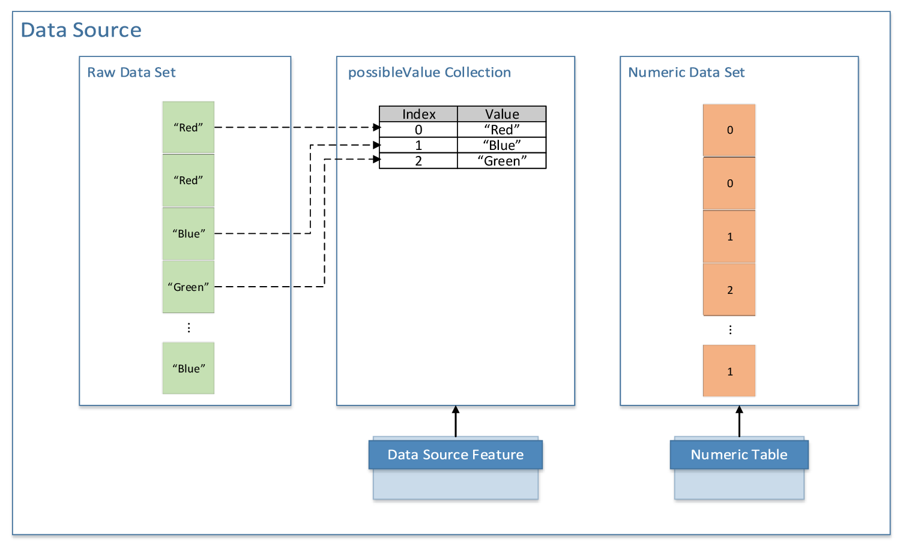

.. Copyright 2019 Intel Corporation
..
.. Licensed under the Apache License, Version 2.0 (the "License");
.. you may not use this file except in compliance with the License.
.. You may obtain a copy of the License at
..
..     http://www.apache.org/licenses/LICENSE-2.0
..
.. Unless required by applicable law or agreed to in writing, software
.. distributed under the License is distributed on an "AS IS" BASIS,
.. WITHOUT WARRANTIES OR CONDITIONS OF ANY KIND, either express or implied.
.. See the License for the specific language governing permissions and
.. limitations under the License.

Data Sources
============

Data sources define interfaces for access and management of data in
raw format and out-of-memory data. A data source is closely coupled
with the data dictionary that describes the structure of the data
associated with the data source. To create the associated data
dictionary, you can do one of the following:

-  While constructing a data source object, specify whether it should
   automatically create and initialize the associated data
   dictionary.
-  Call the createDictionaryFromContext() method.

The getDictionary() method returns the dictionary associated with the
data source.

Data sources stream and transform raw out-of-memory data into numeric
in-memory data accessible through numeric table interfaces. A data
source is associated with the corresponding numeric table. To
allocate the associated numeric table, you can do one of the
following:

-  While constructing a data source object, specify whether it should
   automatically allocate the numeric table.
-  Call the allocateNumericTable() method.

The getNumericTable() method returns the numeric table associated
with the data source.

To retrieve the number of columns (features) in a raw data set, use
the getNumberOfColumns() method. To retrieve the number of rows
(observations) available in a raw data set, use the
getNumberOfAvailableRows() method. The getStatus() method returns the
current status of the data source:

-

   readyForLoad - the data is available for the load operation.

-

   waitingForData - the data source is waiting for new data to arrive
   later; designated for data sources that deal with asynchronous
   data streaming, that is, the data arriving in blocks at different
   points in time.

-

   endOfData- all the data is already loaded.

Because the entire out-of-memory data set may fail to fit into
memory, as well as for performance reasons, |short_name| implements
data loading in blocks. Use the loadDataBlock() method to load the
next block of data into the numeric table. This method enables you to
load a data block into an internally allocated numeric table or into
the provided numeric table. In both cases, you can specify the number
of rows or not. The method also recalculates basic statistics
associated with this numeric table.

|short_name| maintains the list of possible values associated with
categorical features to convert them into a numeric form. In this
list, a new index is assigned to each new value found in the raw data
set. You can get the list of possible values from the possibleValues
collection associated with the corresponding feature in the data
source. In the case you have several data sets with same data
structure and you want to use continuous indexing, do the following:

#.

   Retrieve the data dictionary from the last data source using the
   getDictionary() method.

#.

   Assign this dictionary to the next data source using the
   setDictionary() method.

#.

   Repeat these steps for each next data source.

  Reading from a Data Source

|short_name| implements classes for some popular types of data
sources. Each of these classes takes a feature manager class as the
class template parameter. The feature manager parses, filters, and
normalizes the data and converts it into a numeric format. The
following are the data sources and the corresponding feature
manager classes:

-  Text file (FileDataSource class), to be used with the
   CSVFeatureManager class
-  ODBC (ODBCDataSource class), to be used with the
   MySQLFeatureManager class
-  In-memory text (StringDataSource class), to be used with the
   CSVFeatureManager class
-  `KDB <https://kx.com/>`_ relational database (KDBDataSource class),
   to be used with the KDBFeatureManager class

CSVFeatureManager provides additional capabilities for features
modification. Use addModifier() to enable specific modification when
loading data to a numeric table:

-  Add the ColumnFilter object if you need to have a predefined
   subset of features loaded
-  Add the OneHotEncoder object if you need a categorical feature to
   be encoded using the one-hot scheme

Feature managers provide additional capabilities for the modification
of the input data during its loading. Use the Feature modifier entity
to define desired modification. Feature modifiers enables you to
implement a wide range of feature extraction or transformation
techniques, for instance, feature binarization, one-hot-encoding, or
polynomial features generation. To enable specific modification, use
the addModifier() method that accepts two parameters:

-  featureIds - a subset of feature identifiers for which you want to
   apply modification.
-  featureModifier - an implementation of the Feature modifier, an
   object that implements the FeatureModifierIface interface and
   specifies the way how features of the input data set should be
   modified and written to the output numeric table.

Typical feature modifiers usage scenario is the following:

#. Create the data source object and specify a feature manager and
   its parameters.
#. Define a subset of features for modification and proper feature
   modifier.
#. Add modifier to the feature manager of the data source object.
#. Call loadDataBlock(), it causes data set loading and applying
   specified modification procedure to the features of the data set.

The code block bellow demonstrates feature modifiers usage scenario
in case of FileDataSource and CSVFeatureManager.

::

   // Crate DataSource object (for example FileDataSource)
   FileDataSource<CSVFeatureManager> ds("file.csv", options);

   // Specify features subset and modifier
   auto featureIds = features::list("f1", "f2");
   auto featureModifier = modifiers::csv::continuous();

   // Add modifier to feature manager
   ds.getFeatureManager().addModifier(featureIds, modifier);

   // Cause data loading
   ds.loadDataBlock();

A feature subset may be defined with the functions list(…) ,
range(…), all(), or allReverse() located in the namespace
data_management::features. For example, you can use numerical or
string identifiers to refer to the particular feature in the data
set. A string identifier may correspond to a feature name (for
instance, name in CSV header or in SQL table column name) and
numerical one to the index of a feature. The following code block
shows several ways to define a feature subset. f1 , f2, and f4 are
the names of the respective columns in CSV file or SQL table, and the
numbers 0, 2 - 4 are the indices of columns starting from the left
one.

::

   features::list("f1", "f2")   // String identifiers
   features::list(0, 3);        // Numerical identifiers
   features::list("f1", 2);     // Mixed identifiers
   features::range(0, 4);       // Range of features, the same as list(0,…,4)
   features::range("f1", "f4"); // Range with string identifiers
   features::all();             // Refer to all features in the data set
   features::allReverse()       // Like features::all() but in reverse order

   // With STL vector
   std::vector<features::IdFactory> fv;
   fv.push_back("f2"); fv.push_back(3);
   features::list(fv);

   // With C++ 11 initializer list
   features::list({ "f2", 3, "f1" });

We will use the term *input features* to refer to the columns of raw
out-of-memory data and the term *output features* for the columns of
numeric in-memory data. A feature modifier transforms specified input
features subset to the output features. The number of output features
is determined by the modifier. A feature modifier is expected to read
the values corresponding to specified input features from the i-th
row and write modified values to the i-th row of the output numeric
table. In general case, feature modifier is able to process arbitrary
number of input features to arbitrary number of output features.
Let's assume that we added m modifiers along with the features
subsets :math:`F_1, \ldots, F_m` and the :math:`j`-th modifier has the
:math:`C_j` output columns, where :math:`F_j = (f_{i_1}^j, \ldots, f_{i_{n_j}}^j)`
are specified input features of interest, :math:`f_i^j \in \{f_1, \ldots, f_p\}`,
:math:`f_1, \ldots, f_p` are all possible features, :math:`p` is the
number of features in the input data. The output numeric table will
contain :math:`C_1 + C_2 + \ldots + C_m` columns. The :math:`j`-th feature modifier writes result to
the columns starting with the index :math:`C_k`, in particular the
first feature modifier writes to the first :math:`C_1` columns, and
the last to the last :math:`C_m` columns of the output table. The
following picture demonstrates the case of two modifiers. *Feature
Modifier 1* reads the features :math:`f_1, f_3` from an input
data set, performs data transformation and writes the result to the
columns 1, 2 in the output numeric table. *Feature Modifier 2*
behaves similarly, but processes features :math:`f_2, f_5` and
has 3 output features.

.. figure:: ./images/data-source-2.png
  :width: 600
  :alt:

  Feature Modifiers

The |short_name| has several predefined feature modifiers available
for CSV and SQL feature managers.

-  continuous - parses input values as real numbers, the number of
   output features is equal to the number of input features.
-  categorical - parses input values as categorical features
   (described above), the number of output features is equal to the
   number of input features.
-  automatic - automatically selects appropriate parsing scheme
   (continuous or categorical)
-  oneHotEncoder - apply one-hot-encoding scheme for input features,
   the number of output features is equal to the sum of unique values
   for features in the input data set.

.. note::
   The current version of the library does not provide predefined feature
   modifiers for handling ordinal features.

You can implement you own feature modifier by inheriting from
FeatureModifierBase and overriding its methods. An example interface
of user-defined feature modifier is shown in the code block bellow:

::

   class MyFeatureModifier : public modifiers::csv::FeatureModifierBase
   {
   public:
      virtual void initialize(modifiers::csv::Config &config);
      virtual void apply(modifiers::csv::Context &context);
      virtual void finalize(modifiers::csv::Config &config);
   };

Use the addModifier(…) method to add the user-defined modifier to the
feature manager:

::

   ds.getFeatureManager().addModifier(
      features::list(0, 3), modifiers::custom<MyFeatureModifier>()
   );

Feature modifier's lifetime consists of three stages:

#. Initialization. Feature manager performs modifier initialization
   by calling the initialize method. The Config class provides
   methods to change configuration of the modifier. For example use
   the Config::setNumberOfOutputFeatures(…) to adjust numbers of
   output features produced by the modifier. By default, the number
   of output feature is equal to the number of input features.
#. Applying loop. Feature manager calls the apply method for every
   row in the input data set, information about the current row is
   provided via context object. To implement this method, you need to
   get the input data from the context, carry out desired
   transformation and write result back to the context output buffer.
   You can get the output buffer by calling the
   Context::getOutputBuffer() method, the buffer's size must be equal
   to the number of output features you specified at the
   initialization stage.
#. Finalization. Finalization happens when feature manager calls the
   finalize method with the same config object passed at the
   initialization stage. For example, you may use this method to
   release intermediate buffers when the data transformation is done.

Note that exact set of methods available for Config and Context
depends on the data source type. Please refer to Developer Reference
to get detailed information about supported methods.

Samples
-------

- :cpp_sample:`mysql/sources/datasource_mysql.cpp`

Examples
--------

-  :cpp_example:`datasource/simple_csv_feature_modifiers.cpp`
-  :cpp_example:`datasource/custom_csv_feature_modifiers.cpp`
