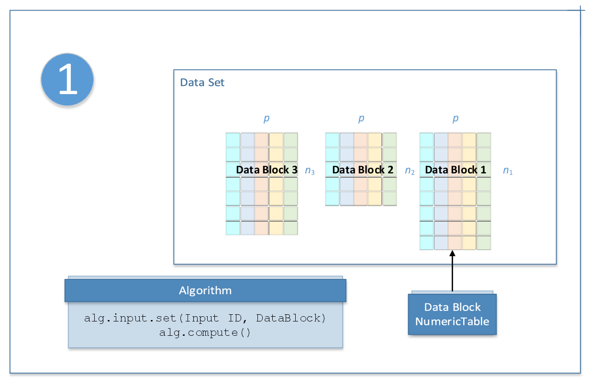
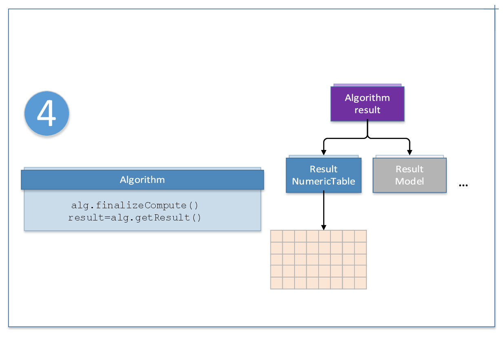

.. Copyright 2020 Intel Corporation
..
.. Licensed under the Apache License, Version 2.0 (the "License");
.. you may not use this file except in compliance with the License.
.. You may obtain a copy of the License at
..
..     http://www.apache.org/licenses/LICENSE-2.0
..
.. Unless required by applicable law or agreed to in writing, software
.. distributed under the License is distributed on an "AS IS" BASIS,
.. WITHOUT WARRANTIES OR CONDITIONS OF ANY KIND, either express or implied.
.. See the License for the specific language governing permissions and
.. limitations under the License.

Computation Modes
=================

The library algorithms support the following computation modes:

- `Batch processing`_
- `Online processing`_
- `Distributed processing`_

You can select the computation mode during initialization of the Algorithm.

For a list of computation parameters of a specific algorithm in each computation mode, possible input types, and output results,
refer to the description of an appropriate algorithm.

.. _batch_mode:

Batch processing
****************

All |short_name| algorithms support at least the batch processing computation mode.
In the batch processing mode, the only compute method of a particular algorithm class is used.

.. _online_mode:

Online processing
*****************

Some |short_name| algorithms enable processing of data sets in blocks.
In the online processing mode, the ``compute()``, and ``finalizeCompute()`` methods of a particular algorithm class are used.
This computation mode assumes that the data arrives in blocks :math:`i = 1, 2, 3, \ldots \text{nblocks}`.
Call the ``compute()`` method each time a new input becomes available.
When the last block of data arrives, call the ``finalizeCompute()`` method to produce final results.
If the input data arrives in an asynchronous mode, you can use the ``getStatus()`` method
for a given data source to check whether a new block of data is available for loading.

The following diagram illustrates the computation schema for online processing:

.. figure:: ./images/online-2.png
  :width: 600
  :alt:

.. note::

    While different data blocks may have different numbers of observations :math:`n_i`,
    they must have the same number of feature vectors :math:`p`.

.. figure:: ./images/online-3.png
  :width: 600
  :alt:

.. _distributed_mode:

Distributed processing
**********************

Some |short_name| algorithms enable processing of data sets distributed across several devices.
In distributed processing mode, the ``compute()`` and the ``finalizeCompute()`` methods of a particular algorithm class are used.
This computation mode assumes that the data set is split in nblocks blocks across computation nodes.

Computation is done in several steps.
You need to define the computation step for an algorithm by providing the computeStep value to the constructor during
initialization of the algorithm. Use the ``compute()`` method on each computation node to compute partial results.
Use the ``input.add()`` method on the master node to add pointers to partial results processed on each computation node.
When the last partial result arrives, call the ``compute()`` method followed by ``finalizeCompute()`` to produce final results.
If the input data arrives in an asynchronous mode, you can use the ``getStatus()`` method for a given data source to check whether
a new block of data is available for loading.

The computation schema is algorithm-specific. The following diagram illustrates a typical computation schema for distribute processing:

.. figure:: ./images/distributed-1.png
  :width: 600
  :alt:

.. figure:: ./images/distributed-2.png
  :width: 600
  :alt:

For the algorithm-specific computation schema, refer to the Distributed Processing section in the description of an appropriate algorithm.

Distributed algorithms in |short_name| are abstracted from underlying cross-device communication technology,
which enables use of the library in a variety of multi-device computing and data transfer scenarios.
They include but are not limited to MPI* based cluster environments, Hadoop* or Spark* based cluster environments,
low-level data exchange protocols, and more.
