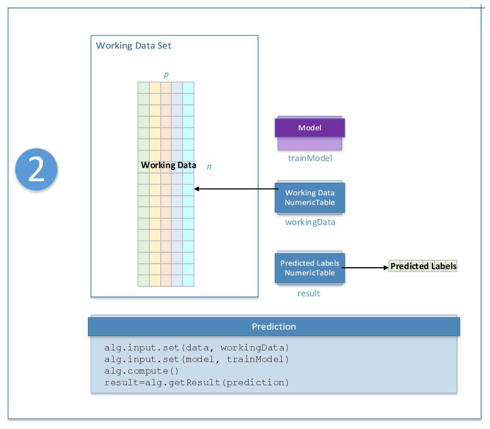

.. Copyright 2020 Intel Corporation
..
.. Licensed under the Apache License, Version 2.0 (the "License");
.. you may not use this file except in compliance with the License.
.. You may obtain a copy of the License at
..
..     http://www.apache.org/licenses/LICENSE-2.0
..
.. Unless required by applicable law or agreed to in writing, software
.. distributed under the License is distributed on an "AS IS" BASIS,
.. WITHOUT WARRANTIES OR CONDITIONS OF ANY KIND, either express or implied.
.. See the License for the specific language governing permissions and
.. limitations under the License.

.. _classification_usage_model:

Classification Usage Model
==========================

A typical workflow for classification methods includes training and prediction, as explained below.

Algorithm-Specific Parameters
*****************************

The parameters used by classification algorithms at each stage depend on a specific algorithm. For a list of these parameters, refer to the description of an appropriate classification algorithm.

Training Stage
**************

.. figure:: images/training-stage-classification.png
    :width: 600
    :alt:

    Classification Usage Model: Training Stage

At the training stage, classification algorithms accept the input described below.
Pass the ``Input ID`` as a parameter to the methods that provide input for your algorithm.
For more details, see :ref:`algorithms`.

.. tabularcolumns::  |\Y{0.2}|\Y{0.8}|

.. list-table:: Training Input for Classification Algorithms
   :widths: 10 60
   :header-rows: 1
   :class: longtable

   * - Input ID
     - Input
   * - ``data``
     - Pointer to the :math:`n \times p` numeric table with the training data set.
       This table can be an object of any class derived from ``NumericTable``.

   * - ``weights``
     - Weights of the observations in the training data set.
       Argument is optional, but it is required by the selected algorithms.

   * - ``labels``
     - Pointer to the :math:`n \times 1` numeric table with class labels.

       This table can be an object of any class derived from NumericTable except ``PackedSymmetricMatrix`` and ``PackedTriangularMatrix``.

At the training stage, classification algorithms calculate the result described below.
Pass the ``Result ID`` as a parameter to the methods that access the results of your algorithm.
For more details, see :ref:`algorithms`.

.. tabularcolumns::  |\Y{0.2}|\Y{0.8}|

.. list-table:: Training Output for Classification Algorithms
   :widths: 10 60
   :header-rows: 1

   * - Result ID
     - Result
   * - ``model``
     - Pointer to the classification model being trained. The result can only be an object of the ``Model`` class.

Prediction Stage
****************

    Classification Usage Model: Prediction Stage

At the prediction stage, classification algorithms accept the input described below.
Pass the ``Input ID`` as a parameter to the methods that provide input for your algorithm.
For more details, see :ref:`algorithms`.

.. tabularcolumns::  |\Y{0.2}|\Y{0.8}|

.. list-table:: Prediction Input for Classification Algorithms
   :widths: 10 60
   :header-rows: 1
   :class: longtable

   * - Input ID
     - Input
   * - ``data``
     - Pointer to the :math:`n \times p` numeric table with the working data set.
       This table can be an object of any class derived from ``NumericTable``.

   * - ``model``
     - Pointer to the trained classification model. This input can only be an object of the ``Model`` class.

At the prediction stage, classification algorithms calculate the result described below.
Pass the ``Result ID`` as a parameter to the methods that access the results of your algorithm.
For more details, see :ref:`algorithms`.

.. tabularcolumns::  |\Y{0.2}|\Y{0.8}|

.. list-table:: Prediction Output for Classification Algorithms
   :widths: 10 60
   :header-rows: 1
   :class: longtable

   * - Result ID
     - Result
   * - ``prediction``
     - Pointer to the :math:`n \times 1` numeric table with classification results (class labels or confidence levels).

       .. note::

          By default, this table is an object of the ``HomogenNumericTable`` class,
          but you can define it as an object of any class derived from ``NumericTable``
          except ``PackedSymmetricMatrix`` and ``PackedTriangularMatrix``.

   * - ``probabilities``
     - A numeric table of size :math:`n \times \text{nClasses}`, containing probabilities of classes computed when the
       ``computeClassProbabilities`` option is enabled. This result table is available for selected algorithms, see corresponding algorithm documentation for details.
   * - ``logProbabilities``
     - A numeric table of size :math:`n \times \text{nClasses}`, containing logarithms of classes' probabilities computed when the ``computeClassLogProbabilities`` option is enabled.
       This result table is available for selected algorithms, see corresponding algorithm documentation for details.

       .. note::

          By default, this table is an object of the ``HomogenNumericTable`` class,
          but you can define it as an object of any class derived from ``NumericTable``
          except ``PackedSymmetricMatrix``, ``PackedTriangularMatrix``, ``CSRNumericTable``.
