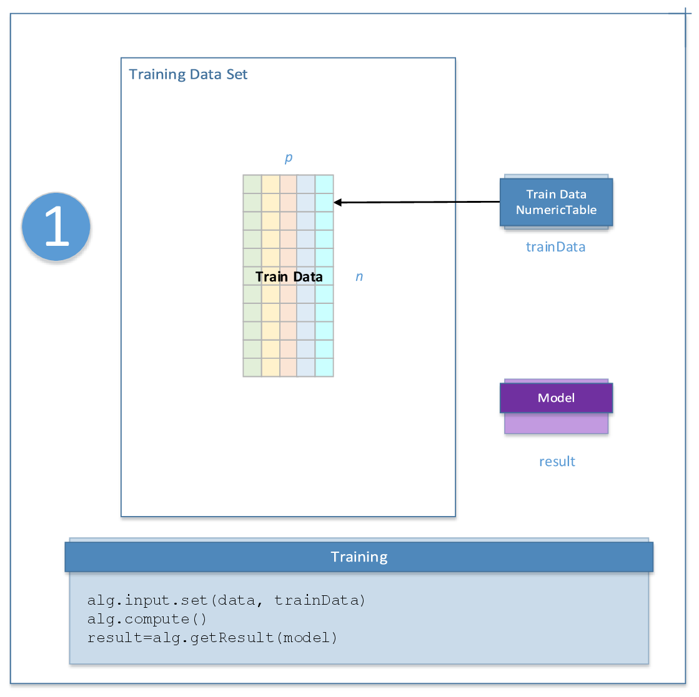
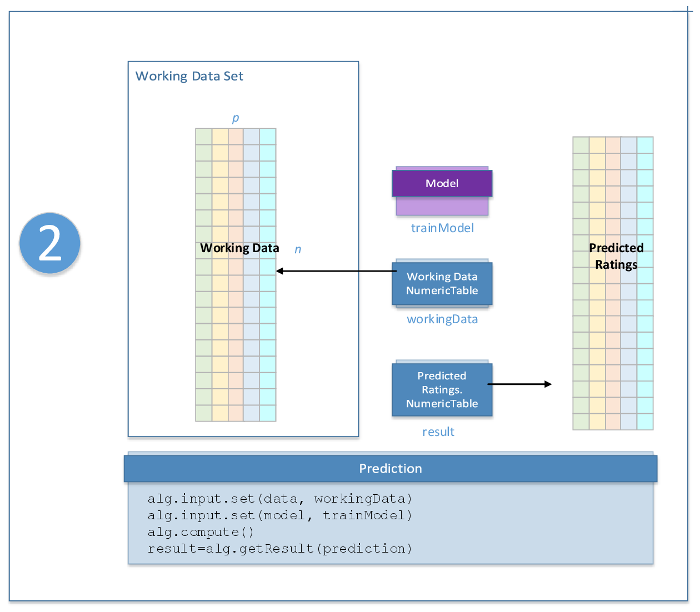

.. ******************************************************************************
.. * Copyright 2020 Intel Corporation
.. *
.. * Licensed under the Apache License, Version 2.0 (the "License");
.. * you may not use this file except in compliance with the License.
.. * You may obtain a copy of the License at
.. *
.. *     http://www.apache.org/licenses/LICENSE-2.0
.. *
.. * Unless required by applicable law or agreed to in writing, software
.. * distributed under the License is distributed on an "AS IS" BASIS,
.. * WITHOUT WARRANTIES OR CONDITIONS OF ANY KIND, either express or implied.
.. * See the License for the specific language governing permissions and
.. * limitations under the License.
.. *******************************************************************************/

.. _recommendation_system_usage_model:

Recommendation Systems Usage Model
==================================

A typical workflow for methods of recommendation systems includes training and prediction, as explained below.

Algorithm-Specific Parameters
*****************************

The parameters used by recommender algorithms at each stage depend on a specific algorithm.
For a list of these parameters, refer to the description of an appropriate recommender algorithm.

Training Stage
**************

    Recommendation Systems Usage Model: Training Stage

At the training stage, recommender algorithms accept the input described below.
Pass the ``Input ID`` as a parameter to the methods that provide input for your algorithm.
For more details, see :ref:`algorithms`.

.. tabularcolumns::  |\Y{0.2}|\Y{0.8}|

.. list-table:: Training Input for Recommender Algorithms
   :widths: 10 60
   :header-rows: 1

   * - Input ID
     - Input
   * - ``data``
     - Pointer to the :math:`m \times n` numeric table with the mining data.

       .. note::

            This table can be an object of any class derived from ``NumericTable``
            except ``PackedTriangularMatrix`` and ``PackedSymmetricMatrix``.

At the training stage, recommender algorithms calculate the result described below.
Pass the ``Result ID`` as a parameter to the methods that access the results of your algorithm.
For more details, see :ref:`algorithms`.

.. tabularcolumns::  |\Y{0.2}|\Y{0.8}|

.. list-table:: Training Output for Recommender Algorithms
   :widths: 10 60
   :header-rows: 1

   * - Result ID
     - Result
   * - ``model``
     - Model with initialized item factors.

       .. note:: The result can only be an object of the ``Model`` class.

Prediction Stage
****************

    Recommendation Systems Usage Model: Prediction Stage

At the prediction stage, recommender algorithms accept the input described below.
Pass the ``Input ID`` as a parameter to the methods that provide input for your algorithm.
For more details, see :ref:`algorithms`.

.. tabularcolumns::  |\Y{0.2}|\Y{0.8}|

.. list-table:: Prediction Input for Recommender Algorithms
   :widths: 10 60
   :header-rows: 1

   * - Input ID
     - Input
   * - ``model``
     - Model with initialized item factors.

       .. note:: This input can only be an object of the ``Model`` class.

At the prediction stage, recommender algorithms calculate the result described below.
Pass the ``Result ID`` as a parameter to the methods that access the results of your algorithm.
For more details, see :ref:`algorithms`.

.. tabularcolumns::  |\Y{0.2}|\Y{0.8}|

.. list-table:: Prediction Output for Recommender Algorithms
   :widths: 10 60
   :header-rows: 1

   * - Result ID
     - Result
   * - ``prediction``
     - Pointer to the :math:`m \times n` numeric table with predicted ratings.

       .. note::

            By default, this table is an object of the ``HomogenNumericTable`` class,
            but you can define it as an object of any class derived from ``NumericTable``
            except ``PackedSymmetricMatrix``, ``PackedTriangularMatrix``, and ``CSRNumericTable``.
