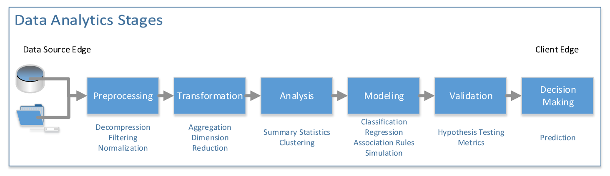
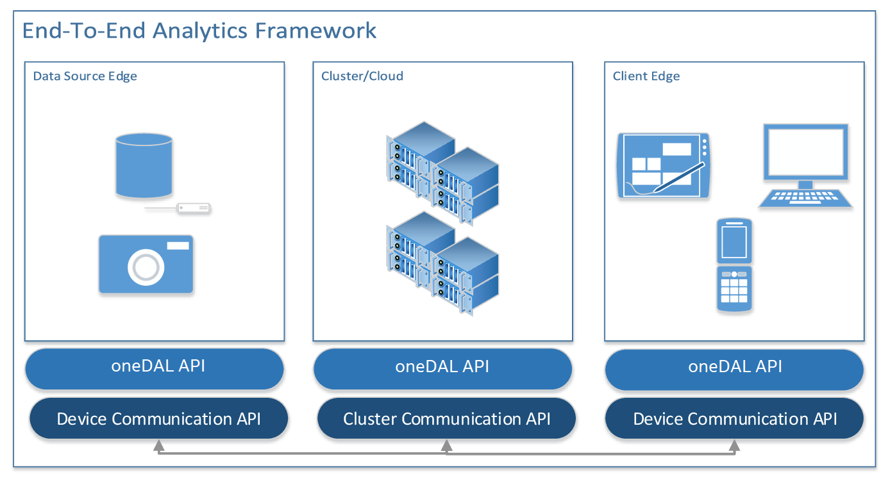

.. ******************************************************************************
.. * Copyright 2020 Intel Corporation
.. *
.. * Licensed under the Apache License, Version 2.0 (the "License");
.. * you may not use this file except in compliance with the License.
.. * You may obtain a copy of the License at
.. *
.. *     http://www.apache.org/licenses/LICENSE-2.0
.. *
.. * Unless required by applicable law or agreed to in writing, software
.. * distributed under the License is distributed on an "AS IS" BASIS,
.. * WITHOUT WARRANTIES OR CONDITIONS OF ANY KIND, either express or implied.
.. * See the License for the specific language governing permissions and
.. * limitations under the License.
.. *******************************************************************************/

Introduction
============

.. _onedal_data_analytics_pipeline:

Data Analytics Pipeline
***********************

|full_name| (|short_name|) is a library that provides building
blocks covering all stages of data analytics: data acquisition from a
data source, preprocessing, transformation, data mining, modeling,
validation, and decision making.

|short_name| supports the concept of the end-to-end analytics when
some of data analytics stages are performed on the edge devices (close
to where the data is generated and where it is finally
consumed). Specifically, |short_name| Application Programming
Interfaces (APIs) are agnostic about a particular cross-device
communication technology and, therefore, can be used within different
end-to-end analytics frameworks.

