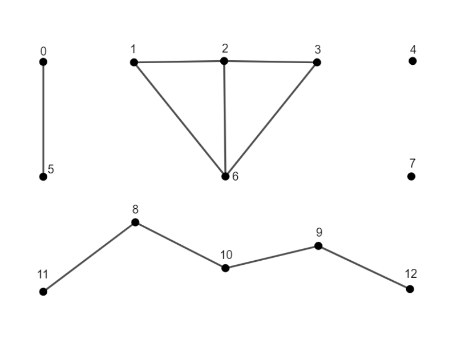

.. ******************************************************************************
.. * Copyright 2021 Intel Corporation
.. *
.. * Licensed under the Apache License, Version 2.0 (the "License");
.. * you may not use this file except in compliance with the License.
.. * You may obtain a copy of the License at
.. *
.. *     http://www.apache.org/licenses/LICENSE-2.0
.. *
.. * Unless required by applicable law or agreed to in writing, software
.. * distributed under the License is distributed on an "AS IS" BASIS,
.. * WITHOUT WARRANTIES OR CONDITIONS OF ANY KIND, either express or implied.
.. * See the License for the specific language governing permissions and
.. * limitations under the License.
.. *******************************************************************************/

.. default-domain:: cpp

.. _alg_connected_components:

====================
Connected Components
====================

.. include::  ../../../includes/graph/connected-components-introduction.rst

------------------------
Mathematical formulation
------------------------

.. _connected_components_compute:

Computing
---------

Given an :capterm:`undirected graph<Undirected graph>` :math:`G`, the problem is to find :capterm:`connected components<Component>` in :math:`G`, 
determine their quantity, and label vertices so that vertices from the same component have the same label.

.. rubric:: Example

 
Сomponents are labeled from :math:`0` to :math:`k-1`, where :math:`k` is the number of components.
For the example above, the labels for vertices are [0, 1, 1, 1, 2, 0, 1, 3, 4, 4, 4, 4, 4].

This notation means that:

* vertices with ids 0 and 5 belong to the connected component with id 0 
* vertices with ids 1, 2, 3, and 6 belong to the connected component with id 1 
* vertex with id 4 belongs to the connected component with id 2 
* vertex with id 7 belongs to the connected component with id 3 
* vertices with ids 8, 9, 10, 11, and 12 belong to the connected component with id 4 

.. _connected_components_afforest:

Computation method: *afforest*
------------------------------
The method defines Afforest algorithm and solves the problem of сonnected components identification in an undirected graph.

This algorithm expands the Shiloach-Vishkin connected components algorithm and uses component approximation to decrease redundant edge processing. The method consists of the following steps:

#. Process a fixed number of edges for each vertex (Vertex Neighbor Sampling optimization).
#. Identify the largest intermediate component using probabilistic method.
#. Process the rest of the neighborhoods only for the vertices that do not belong to the largest component (Large Component Skipping optimization).

For more details, see [Sutton2018]_.

---------------------
Programming Interface
---------------------

Refer to :ref:`API Reference: Connected Components <api_connected_components>`.

--------
Examples
--------

.. include:: ../../../includes/graph/connected-components-examples.rst
