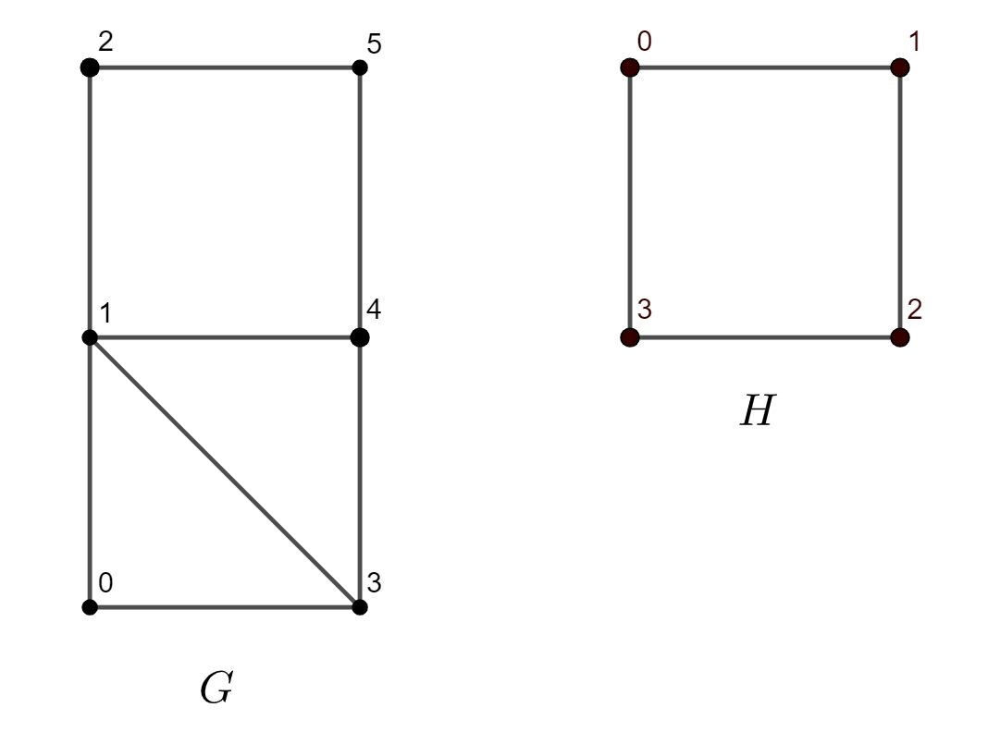

.. ******************************************************************************
.. * Copyright 2021 Intel Corporation
.. *
.. * Licensed under the Apache License, Version 2.0 (the "License");
.. * you may not use this file except in compliance with the License.
.. * You may obtain a copy of the License at
.. *
.. *     http://www.apache.org/licenses/LICENSE-2.0
.. *
.. * Unless required by applicable law or agreed to in writing, software
.. * distributed under the License is distributed on an "AS IS" BASIS,
.. * WITHOUT WARRANTIES OR CONDITIONS OF ANY KIND, either express or implied.
.. * See the License for the specific language governing permissions and
.. * limitations under the License.
.. *******************************************************************************/

.. default-domain:: cpp

.. _alg_subgraph_isomorphism:

====================
Subgraph Isomorphism
====================

.. include::  ../../../includes/graph/subgraph-isomorphism-introduction.rst

------------------------
Mathematical formulation
------------------------

.. _subgraph_isomorphism_compute:

Subgraphs definition
--------------------

A graph :math:`H = (V'; E')` is called a subgraph of graph :math:`G = (V; E)` if 
:math:`V' \subseteq V; E' \subseteq E` and :math:`V'` contains all the endpoints of all the 
edges in :math:`E'` [Gross2014]_.

Further we denote the :capterm:`induced subgraph on the vertex set<Induced subgraph on the vertex set>` 
as **induced** subgraph, the :capterm:`induced subgraph on the edge set<Induced subgraph on the edge set>`
as **non-induced** subgraph.

Computing
---------

Given two graphs :math:`G` and :math:`H`, the problem is to determine whether graph :math:`G` contains
a subgraph isomorphic to graph :math:`H` and find the exact mapping of subgraph :math:`H` in
graph :math:`G`.

:math:`G` is called **target** graph, :math:`H` is called **pattern** graph.

Mapping is a bijection or one-to-one correspondence between vertices of :math:`H` and a subgraph of 
graph :math:`G`. Two vertices are adjacent if there is an existing edge between them, and non-adjacent otherwise.
Induced subgraph isomorphism preserves both adjacency and non-adjacency relationships between vertices,
while non-induced subgraph isomorphism preserves only adjacency relationship.

.. rubric:: Example

For the example above, the mappings for subgraph :math:`H` in graph :math:`G` are:

- Induced: [3, 0, 1, 4, 2, 5]
- Non-induced: [3, 0, 1, 4, 2, 5], [3, 6, 1, 4, 2, 5], [6, 0, 1, 2, 4, 5], and [4, 0, 1, 5, 6, 2]

The notation [3, 0, 1, 4, 2, 5] means that:

* pattern vertex with id 0 is mapped on vertex in target graph with id 3
* pattern vertex with id 1 is mapped on vertex in target graph with id 0
* pattern vertex with id 2 is mapped on vertex in target graph with id 1
* pattern vertex with id 3 is mapped on vertex in target graph with id 4
* pattern vertex with id 4 is mapped on vertex in target graph with id 2
* pattern vertex with id 5 is mapped on vertex in target graph with id 5

.. _subgraph_isomorphism_fast:

Computation method: *fast*
---------------------------

The method defines VF3-light algorithms with Global State Stack parallelization method
and supports induced and non-induced cases.

For more details, see [Carletti2021]_.

---------------------
Programming Interface
---------------------

Refer to :ref:`API Reference: Subgraph Isomorphism <api_subgraph_isomorphism>`.

--------
Examples
--------

.. include:: ../../../includes/graph/subgraph-isomorphism-examples.rst
