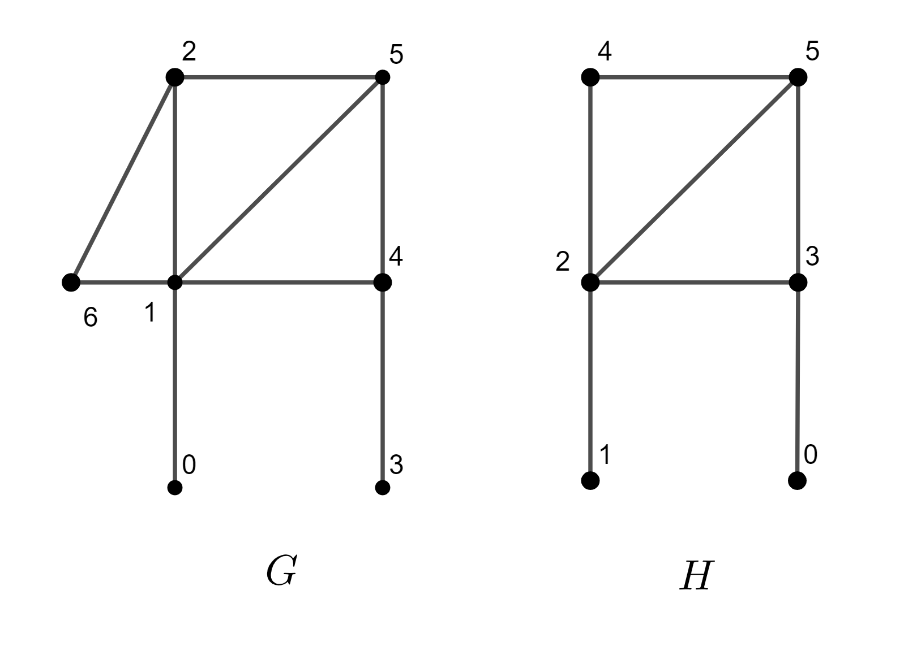

.. ******************************************************************************
.. * Copyright 2021 Intel Corporation
.. *
.. * Licensed under the Apache License, Version 2.0 (the "License");
.. * you may not use this file except in compliance with the License.
.. * You may obtain a copy of the License at
.. *
.. *     http://www.apache.org/licenses/LICENSE-2.0
.. *
.. * Unless required by applicable law or agreed to in writing, software
.. * distributed under the License is distributed on an "AS IS" BASIS,
.. * WITHOUT WARRANTIES OR CONDITIONS OF ANY KIND, either express or implied.
.. * See the License for the specific language governing permissions and
.. * limitations under the License.
.. *******************************************************************************/

.. default-domain:: cpp

.. _alg_subgraph_isomorphism:

====================
Subgraph isomorphism
====================

.. include::  ../../../includes/graph/subgraph-isomorphism-introduction.rst

------------------------
Mathematical formulation
------------------------

.. _subgraph_isomorphism_c_math:

Subgraphs definition
--------------------

A graph :math:`H = (V'; E')` is called a subgraph of graph :math:`G = (V; E)` if 
:math:`V' \subseteq V; E' \subseteq E` and :math:`V'` contains all the endpoints of all the 
edges in :math:`E'`.

Each subset :math:`E' \subseteq E` defines a unique subgraph :math:`H' = (V'; E')` of graph 
:math:`G = (V; E)`, where :math:`V'` consists of only those vertices which are the endpoints of the
edges in :math:`E'`. The subgraph :math:`G'` is called the induced subgraph of :math:`G` on the
edge set :math:`E'`.

Each subset :math:`V' \subseteq V` defines a unique subgraph :math:`H = (V'; E')` of graph 
:math:`G = (V; E)`, where :math:`E'` consists of those edges whose endpoints are in :math:`V'`. 
The subgraph :math:`G'` is called the induced subgraph of :math:`G` on the vertex set :math:`V'`.

Further we denote the :capterm:`induced subgraph on the vertex set<Induced subgraph on the vertex set>` 
as **induced** subgraph, the :capterm:`induced subgraph on the edge set<Induced subgraph on the edge set>`
as **non-induced** subgraph.

Computing
---------

Given two graphs :math:`G` and :math:`H`, the problem is to define whether graph :math:`G` contains
a subgraph which is isomorphic to graph :math:`H` and find exact mapping of subgraph :math:`H` in
graph :math:`G`.

Mapping is bijection or one-to-one correspondence between vertices of :math:`H` and subgraph of 
graph :math:`G` with correspond vertex adjacensy relationship preserving for non-induced subgraph 
and adjacensy and non-adjacensy preserving relationship for induced case.

Given a set :math:`U` of :math:`n` feature vectors :math:`u_1 = (u_{11}, \ldots, u_{1k}),
\ldots, u_n = (u_{n1}, \ldots, u_{nk})` of dimension :math:`k` and a set :math:`V` of :math:`m`
feature vectors :math:`v_1 = (v_{11}, \ldots, v_{1k}), \ldots, v_m = (v_{m1}, \ldots, v_{mk})`
of dimension :math:`k`, the problem is to compute the Chebyshev distance
:math:`||u_i, v_j||_{\infty}` for any pair of input vectors:

.. math::
    ||u_i, v_j||_{\infty} = \max_l {|u_{il} - v_{jl}|},

where :math:`\quad 1 \leq i \leq n, \quad 1 \leq j \leq m, \quad 1 \leq l \leq k`.

.. _subgraph_isomorphism_c_dense:

Computation method: *dense*
---------------------------
The method defines Chebyshev distance metric, which is used in other algorithms
for the distance computation. There are no separate computation mode to compute distance
manually.

For more details, see [Carletti2021]_.

---------------------
Programming Interface
---------------------

Refer to :ref:`API Reference: Subgraph Isomorphism <api_subgraph_isomorphism>`.

--------
Examples
--------

.. include:: ../../../includes/graph/subgraph-isomorphism-examples.rst
