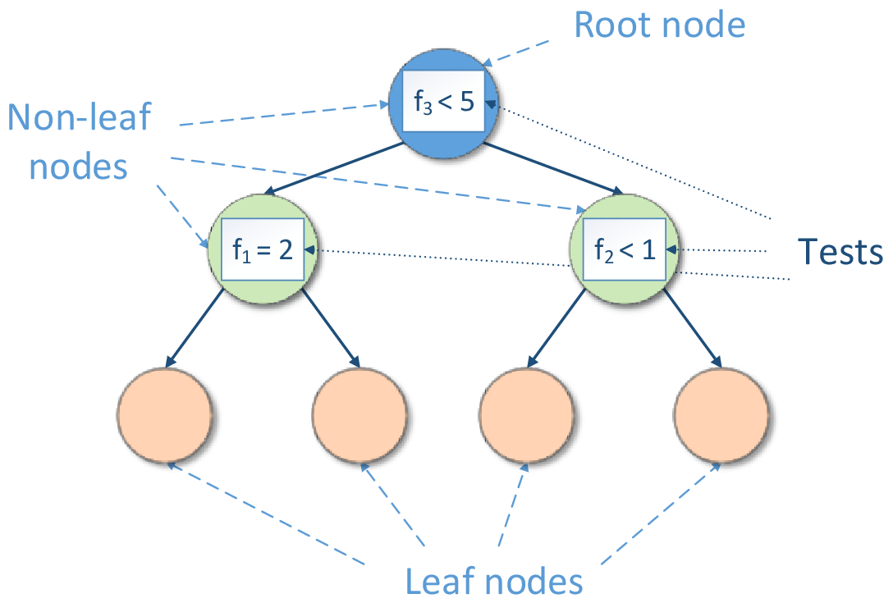

.. Copyright 2021 Intel Corporation
..
.. Licensed under the Apache License, Version 2.0 (the "License");
.. you may not use this file except in compliance with the License.
.. You may obtain a copy of the License at
..
..     http://www.apache.org/licenses/LICENSE-2.0
..
.. Unless required by applicable law or agreed to in writing, software
.. distributed under the License is distributed on an "AS IS" BASIS,
.. WITHOUT WARRANTIES OR CONDITIONS OF ANY KIND, either express or implied.
.. See the License for the specific language governing permissions and
.. limitations under the License.

.. _dt:

Decision Tree
*************

Decision trees partition the feature space into a set of hypercubes,
and then fit a simple model in each hypercube. The simple model can
be a prediction model, which ignores all predictors and predicts the
majority (most frequent) class (or the mean of a dependent variable
for regression), also known as 0-R or constant classifier.

Decision tree induction forms a tree-like graph structure as shown in
the figure below, where:

-  Each internal (non-leaf) node denotes a test on one of the features
-  Each branch descending from a non-leaf node corresponds to an outcome of the
   test
-  Each external node (leaf) denotes the mentioned simple model

  Decision Tree Structure

A test is a rule for partitioning the feature space. A test
depends on feature values. Each outcome of a test represents an
appropriate hypercube associated with both the test and one of the
descending branches.

If a test is a Boolean expression (for
example, :math:`f < c` or :math:`f = c`, where :math:`f` is a feature and :math:`c` is a constant fitted
during decision tree induction), the inducted decision tree is a
binary tree, so its non-leaf nodes have exactly two branches,
'true' and 'false', each corresponding to the result of the Boolean
expression.

Prediction is performed by starting at the root node of the tree,
testing features by the test specified in this node, then moving down
the tree branch corresponding to the outcome of the test for the
given sample. This process is then repeated for the subtree rooted
at the node, discovered at the selected branch. The final result is the prediction of the simple
model at the leaf node.

Decision trees are often used in ensemble algorithms, such as boosting, bagging, or decision forest.
