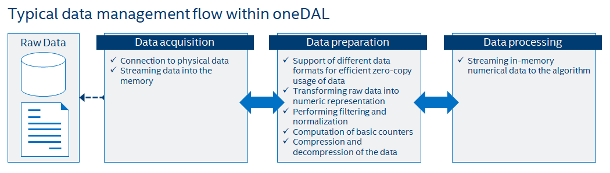

.. Copyright 2020 Intel Corporation
..
.. Licensed under the Apache License, Version 2.0 (the "License");
.. you may not use this file except in compliance with the License.
.. You may obtain a copy of the License at
..
..     http://www.apache.org/licenses/LICENSE-2.0
..
.. Unless required by applicable law or agreed to in writing, software
.. distributed under the License is distributed on an "AS IS" BASIS,
.. WITHOUT WARRANTIES OR CONDITIONS OF ANY KIND, either express or implied.
.. See the License for the specific language governing permissions and
.. limitations under the License.

.. _dg_data_management:

===============
Data Management
===============

This section includes concepts and objects that operate on data. For
|short_name|, such set of operations, or **data management**, is distributed
between different stages of the :txtref:`data analytics pipeline
<onedal_data_analytics_pipeline>`. From a perspective of data management, this pipeline
contains three main steps of data acquisition, preparation, and computation (see
:txtref:`the picture below <typical_data_management_flow>`):

#. Raw data acquisition

   - Transfer out-of-memory data from various sources (databases, files, remote
     storage) into an in-memory representation.

#. Data preparation

   - Support different in-memory :capterm:`data formats <data format>`.
   - Compress and decompress the data.
   - Convert the data into numeric representation.
   - Recover missing values.
   - Filter the data and perform data normalization.
   - Compute various statistical metrics for numerical data, such as mean, variance,
     and covariance.

#. Algorithm computation

   - Stream in-memory numerical data to the algorithm.

In complex usage scenarios, data flow goes through these three stages back and
forth. For example, when the data are not fully available at the start of the
computation, it can be done step-by-step using blocks of data. After the
computation on the current block is completed, the next block should be obtained
and prepared.

.. _typical_data_management_flow:

  Data Management Flow in oneDAL

Key concepts
============

|short_name| provides a set of concepts to operate on out-of-memory and
in-memory data during different stages of the :txtref:`data analytics pipeline
<onedal_data_analytics_pipeline>`.

.. _dataset:

Dataset
--------

The main data-related concept that |short_name| works with is a
:capterm:`dataset`. It is a collection of data in a specific data format.

.. figure:: _static/dataset.png
  :width: 400
  :alt: Dataset

The dataset is used across all stages of the data analytics pipeline. For
example:

#. At the acquisition stage, it is downloaded into the
   local memory.

#. At the preparation stage, it is converted into a numerical
   representation.

#. At the computation stage, it is used as one of the inputs or
   results of an algorithm or a descriptor properties.

.. _data-source:

Data source
-----------

Data source is a concept of an out-of-memory storage for a :capterm:`dataset`.
It is used at the data acquisition and data preparation stages to:

- Extract datasets from external sources such as databases, files, remote
  storage.

- Load datasets into the device's local memory. Data do not always fit
  the local memory, especially when processing with accelerators. A data source
  provides the ability to load data by batches and extracts it directly into the
  device's local memory. Therefore, a data source enables complex data analytics
  scenarios, such as :capterm:`online computations <Online mode>`.

- Transform datasets into their numerical representation. Data source
  automatically transforms non-numeric :capterm:`categorical <categorical
  feature>` and :capterm:`continuous <continuous feature>` data values into one
  of the numeric :capterm:`data formats <data format>`.

For details, see :txtref:`dm_data-sources` section.

.. _table:

Table
-----

Table is a concept of in-memory numerical data that are organized in a tabular
view with several rows and columns. It is used at the data preparation and data
processing stages to:

- Be an in-memory representation of a :txtref:`dataset` or another tabular
  data (for example, matrices, vectors, and scalars).

- Store heterogeneous data in various
  :capterm:`data formats <data format>`, such as dense, sparse, chunked,
  contiguous.

- Avoid unnecessary data copies during conversion from external data
  representations.

- Transfer memory ownership of the data from user application to the table,
  or share it between them.

- Connect with the :txtref:`data-source` to convert data from an
  out-of-memory into an in-memory representation.

- Support streaming of the data to the algorithm.

- Access the underlying data on a device in a required :capterm:`data
  format`, e.g. by blocks with the defined :capterm:`data layout`.

.. note::
  For thread-safety reasons and better integration with external entities, a
  table provides a read-only access to the data within it, thus, table object
  is :capterm:`immutable <immutability>`.

This concept has different logical organization and physical :capterm:`format of
the data <data format>`:

- Logically, a table contains :math:`n` rows and :math:`p` columns.
  Every column may have its own type of data values and a set of allowed
  operations.

- Physically, a table can be organized in different ways: as a
  :capterm:`homogeneous <homogeneous data>`, :capterm:`contiguous <contiguous
  data>` array of bytes, as a :capterm:`heterogeneous <heterogeneous data>` list
  of arrays of different :capterm:`data types <data type>`, in a
  compressed-sparse-row format. The number of bytes needed to store the data
  differs from the number of elements :math:`n \times p` within a table.

For details, see :txtref:`dm_tables` section.

.. _table_metadata:

Table metadata
--------------

Table metadata concept provides an additional information about data in the
table:

#. The :capterm:`data types <Data type>` of the columns.

#. The logical types of data in the columns:
   :capterm:`nominal <Nominal feature>`, :capterm:`ordinal <Ordinal feature>`,
   :capterm:`interval <Interval feature>`, or :capterm:`ratio <Ratio feature>`.

Only the properties of data that do not affect table concept definition is
a part of metadata concept.

.. _accessor:

Accessor
--------

Accessor is a concept that defines a single way to extract the data from a
:txtref:`table`. It allows to:

- Have unified access to the data from :txtref:`table` objects of different
  types, without exposing their implementation details.

- Provide a :capterm:`flat <flat data>` view on the data blocks of a
  :txtref:`table` for better data locality. For example, the accessor returns a
  column of the table stored in row-major format as a contiguous array.

- Acquire data in a desired :capterm:`data format` for which
  a specific set of operations is defined.

- Have read-only access to the data.

For details, see :txtref:`dm_accessors` section.

Example of interaction between table and accessor objects
---------------------------------------------------------

This section provides a basic usage scenario of the :txtref:`table` and
:txtref:`accessor` concepts and demonstrates the relations between them.
:txtref:`The following diagram <table_accessor_usage_example>` shows objects
of these concepts, which are highlighted by colors:

- :txtref:`table` object is dark blue

- :txtref:`accessor` is orange

- :txtref:`table_metadata` is light blue

.. _table_accessor_usage_example:

.. figure:: _static/table_accessor_usage_example.png
  :width: 800
  :alt: Sequence diagram of accessor-builder-table relations

  Sequence diagram of accessor-builder-table relations

To perform computations on a dataset, you have to create a :txtref:`table` object
first. It can be done either using a :txtref:`data-source` or directly from
user-defined memory. The diagram shows the creation of a :txtref:`table` object
`t` from the data provided by user (not shown on the diagram). During a table
creation, an object `tm` of table metadata is constructed and initialized using
the data.

Once a table object is created, it can be used as an input in computations or as
a parameter of some algorithm. The data in the table can be accessed via its own
interface or via read-only accessor as shown on the diagram.

.. _graph:

Graph
-----

A graph is a concept of in-memory structured data that is organized
as a :capterm:`graph` with several vertices and edges.
Graphs can be :capterm:`directed <Directed graph>`, :capterm:`undirected <Undirected graph>`,
:capterm:`weighted <Weighted graph>` and :capterm:`attributed <Attribute>`. Graphs are used
at the data preparation and data processing stages to:

- Be an in-memory representation of a :txtref:`dataset`.

- Store graph data in sparse
  :capterm:`data formats <data format>`.

- Avoid unnecessary data copies during conversion from external data
  representations.

- Connect with the :txtref:`data-source` to convert data from an
  out-of-memory representation into an in-memory representation.

.. note::
  For thread-safety reasons and better integration with external entities, a
  graph provides a read-only access to the data within it, thus, a graph object
  is :capterm:`immutable <immutability>`.

The logical organization of a graph and the physical :capterm:`format of
the data <data format>` are different:

- Logically, a :capterm:`graph` contains :math:`|V|` vertices and :math:`|E|` edges.
  All vertices of the :capterm:`graph` are described with the same data type and
  respective operations on it. Similarly, the same is true for edges and :capterm:`attributes <Attribute>`
  of the :capterm:`graph`. The data types of vertices, edges, and attributes can be different.

- Physically, the :capterm:`topology` of a graph can be organized in :capterm:`CSR <CSR data>`
  and others data formats.

For details, see :txtref:`dm_graphs` section.

Details
=======

This section includes the detailed descriptions of all data management objects in
|short_name|.

.. toctree::

   array.rst
   accessors.rst
   data-sources.rst
   graphs.rst
   tables.rst
