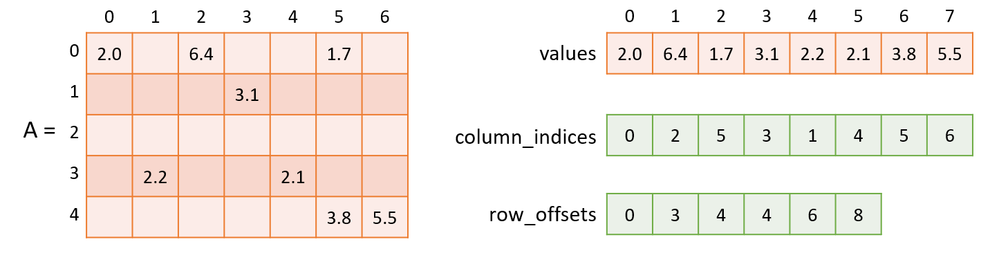

.. Copyright 2023 Intel Corporation
..
.. Licensed under the Apache License, Version 2.0 (the "License");
.. you may not use this file except in compliance with the License.
.. You may obtain a copy of the License at
..
..     http://www.apache.org/licenses/LICENSE-2.0
..
.. Unless required by applicable law or agreed to in writing, software
.. distributed under the License is distributed on an "AS IS" BASIS,
.. WITHOUT WARRANTIES OR CONDITIONS OF ANY KIND, either express or implied.
.. See the License for the specific language governing permissions and
.. limitations under the License.

.. _csr_table:

==================================
Compressed Sparse Rows (CSR) Table
==================================

``csr_table`` class is a subtype of a table type,
for which the following is true:

- All the columns have the same :capterm:`data type <Data type>`.
- The data within the table is sparse and stored in a 3-array format.
- The arrays describe the sparse matrix :math:`A` as follows:

        - The array values contain non-zero elements of the matrix row-by-row.
        - The element number ``j`` of the ``columns_indices`` array encodes
          the column index in the matrix :math:`A` for the jth element
          of the array values.
        - The element number ``i`` of the ``row_offsets`` array encodes
          the index in the array values corresponding to the first non-zero
          element in rows indexed ``i`` or greater.
          The last element in the array ``row_offsets`` encodes the number
          of non-zero elements in the matrix :math:`A`.

        |short_name| supports zero-based and one-based indexing.

  Compressed Sparse Row (CSR) data format with zero-based indexing.

---------------------
Programming Interface
---------------------

Refer to :ref:`API Reference: Compressed Sparse Rows Table <api_csr_table>`
to learn more.
