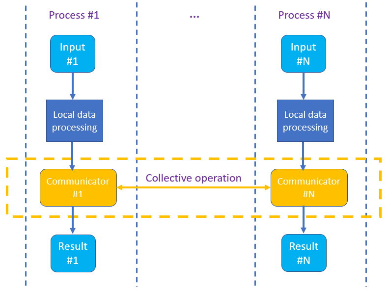

.. ******************************************************************************
.. * Copyright 2021 Intel Corporation
.. *
.. * Licensed under the Apache License, Version 2.0 (the "License");
.. * you may not use this file except in compliance with the License.
.. * You may obtain a copy of the License at
.. *
.. *     http://www.apache.org/licenses/LICENSE-2.0
.. *
.. * Unless required by applicable law or agreed to in writing, software
.. * distributed under the License is distributed on an "AS IS" BASIS,
.. * WITHOUT WARRANTIES OR CONDITIONS OF ANY KIND, either express or implied.
.. * See the License for the specific language governing permissions and
.. * limitations under the License.
.. *******************************************************************************/

.. _dg_spmd:

============================
Single Program Multiple Data
============================

This section includes concepts and descriptions of objects that support 
distributed computations using :capterm:`SPMD` model.

Distributed computation using SPMD model
----------------------------------------

In a typical usage scenario, a user provides a :capterm:`communicator` object as a first parameter of 
a free function to indicate that the algorithm can process data simultaneously. All internal inter-process 
communications at sync points are hidden from the user.

General expectation is that input dataset is distributed among processes. Results are distributed in
accordance with the input.

.. _example_spmd_flow:

  Example of SPMD Flow in the oneAPI Data Analytics Library (oneDAL).

.. _communicator_operations:

Supported Collective Operations
-------------------------------

The following collective operations are supported:

- ``bcast``
  Broadcasts data from specified process.

- ``allreduce``
  Reduces data among all processes.

- ``allgatherv``
  Gathers data from all processes and shares the result among all processes.

- ``sendrecv_replace``
  Sends and receives data using a single buffer.

.. _backend_restrictions:

Backend-specific restrictions
-----------------------------

- oneCCL:
  Allgetherv does not support arbitrary displacements. The result is expected to
  be closely packed without gaps.

- oneMPI:
  Collective operations in oneMPI do not support asynchronous executions. They block the
  process till completion.
